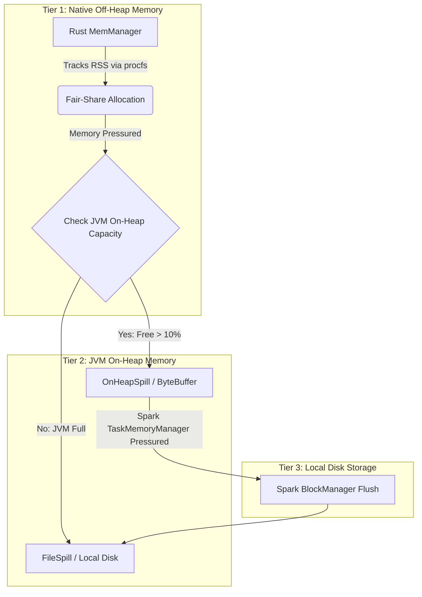

# Apache Auron: Shuffle Read/Write and Dynamic Memory Architecture

Apache Auron is an advanced native vectorized accelerator for big data computing frameworks (such as Apache Spark) that leverages native Rust execution and Apache Arrow columnar formatting to eliminate JVM overhead and accelerate query processing.

To achieve maximum performance, scalability, and stability under heavy distributed workloads, Auron implements a highly sophisticated architecture for shuffle operations and a unified, multi-tiered dynamic memory management system that bridges the JVM and native Rust runtimes.

---

## 1. Shuffle Write Architecture

Auron intercepts Spark’s shuffle mechanism by overriding `spark.shuffle.manager` with [AuronShuffleManager](file:///usr/local/google/home/warrenzhu/auron/spark-extension-shims-spark/src/main/scala/org/apache/spark/sql/execution/auron/shuffle/AuronShuffleManager.scala).

```mermaid
graph TD
    subgraph JVM Runtime
        A[Spark Map Task] -->|getWriter| B(AuronShuffleWriter)
        B -->|Construct Protobuf Plan| C[NativeHelper.executeNativePlan]
    end
    subgraph Native Rust Runtime (DataFusion)
        C -->|JNI Call| D[ShuffleWriterExec]
        D -->|Stage Batches| E[BufferedData]
        E -->|Radix Sort by Part ID| F[SortShuffleRepartitioner]
        F -->|Memory > 80% Threshold| G[Proactive Spilling]
        G -->|Flush Chunk| H[(Spill Files: On-Heap / Disk)]
        F -->|Task Completion| I[OffsettedMergeIterator]
        H --> I
        I -->|Sequential Merge| J[(Final .data & .index Files)]
    end
    J -->|Commit| K[Spark IndexShuffleBlockResolver]
```

### A. Delegation to the Native Engine
When a map task begins, Spark calls `getWriter()`, which returns an [AuronShuffleWriter](file:///usr/local/google/home/warrenzhu/auron/spark-extension-shims-spark/src/main/scala/org/apache/spark/sql/execution/auron/shuffle/AuronShuffleWriter.scala). Instead of executing row-by-row evaluation inside the JVM, `AuronShuffleWriterBase` constructs a `ShuffleWriterExecNode` protobuf containing temporary `.data.tmp` and `.index.tmp` file paths, and delegates execution to the native Rust engine via `NativeHelper.executeNativePlan`.

### B. Native Buffering & Radix Sorting
In the native Rust engine, [ShuffleWriterExec](file:///usr/local/google/home/warrenzhu/auron/native-engine/datafusion-ext-plans/src/shuffle_writer_exec.rs) executes the shuffle write using specialized repartitioning operators (e.g., [SortShuffleRepartitioner](file:///usr/local/google/home/warrenzhu/auron/native-engine/datafusion-ext-plans/src/shuffle/sort_repartitioner.rs)).
* **Staging**: Incoming Arrow `RecordBatch`es are buffered in [BufferedData](file:///usr/local/google/home/warrenzhu/auron/native-engine/datafusion-ext-plans/src/shuffle/buffered_data.rs).
* **Partition Evaluation**: When staging memory exceeds the suggested threshold, Auron evaluates partition IDs for each row (supporting Hash, Range, or RoundRobin partitioning).
* **Radix Sort**: Rows are sorted by partition ID using an ultra-fast integer radix sort (`radix_sort_by_key`), and then interleaved into a single contiguous batch grouped by partition ID.

### C. Proactive Spilling & Merging
* **Memory Registration**: `SortShuffleRepartitioner` implements `MemConsumer` and registers with Auron's native memory manager. Because shuffle buffering is highly flexible, Auron sets a lower spill threshold for it (80% of fair-share memory) to prioritize spilling shuffle buffers over rigid memory consumers like hash joins.
* **Spilling**: When memory pressure occurs, `SortShuffleRepartitioner::spill()` drains `BufferedData` and flushes the compressed partition chunks into temporary spill files.
* **Merging**: At task completion, `shuffle_write()` uses an `OffsettedMergeIterator` to sequentially merge all spilled chunks into the final output `.data` file and writes partition offset lengths into the `.index` file. The JVM then commits these files to Spark's `IndexShuffleBlockResolver`.

---

## 2. Shuffle Read Architecture

On the reduce side, `AuronShuffleManager` overrides `getReader()` and returns an [AuronBlockStoreShuffleReader](file:///usr/local/google/home/warrenzhu/auron/spark-extension-shims-spark/src/main/scala/org/apache/spark/sql/execution/auron/shuffle/AuronBlockStoreShuffleReader.scala).

```mermaid
graph TD
    subgraph JVM Runtime
        A[Spark Reduce Task] -->|getReader| B(AuronBlockStoreShuffleReader)
        B -->|ShuffleBlockFetcherIterator| C[readIpc BlockObject Iterator]
        C -->|Register UUID| D[JniBridge.putResource]
    end
    subgraph Native Rust Runtime (DataFusion)
        D -->|Pass Resource ID| E[IpcReaderExec]
        E -->|Tokio Blocking Task| F[Fetch BlockObject via JNI]
        F -->|hasFileSegment| G[File Reader]
        F -->|hasByteBuffer| H[Direct/Heap ByteBuffer Reader]
        F -->|getChannel| I[ReadableByteChannel Reader]
        G --> J[IpcCompressionReader]
        H --> J
        I --> J
        J -->|Decode & Coalesce| K[Vectorized RecordBatch Stream]
    end
```

### A. IPC Block Abstraction & JNI Registry
Rather than deserializing individual Java objects, Auron fetches raw block streams and encapsulates them using `readIpc()`.
* Each fetched block is wrapped into a [BlockObject](file:///usr/local/google/home/warrenzhu/auron/spark-extension/src/main/scala/org/apache/spark/sql/execution/auron/shuffle/AuronBlockStoreShuffleReaderBase.scala#L177), which abstracts the underlying storage mechanism:
  1. **Local File Segment** (`hasFileSegment`): Points directly to a file path, offset, and length in a local disk file.
  2. **In-Memory Buffer** (`hasByteBuffer`): Encapsulates a Netty or JVM `ByteBuffer`.
  3. **Network Stream** (`getChannel`): Encapsulates a `ReadableByteChannel` for remote network fetches over Netty.
* This iterator of `BlockObject`s is placed into a global JNI resource registry (`JniBridge.putResource`) mapped to a unique UUID.

### B. Native Asynchronous Decoding
The physical plan sent to Rust contains an [IpcReaderExec](file:///usr/local/google/home/warrenzhu/auron/native-engine/datafusion-ext-plans/src/ipc_reader_exec.rs) node with the JNI resource ID.
* Rust retrieves the block iterator via JNI and spawns asynchronous Tokio blocking tasks to consume the blocks.
* Depending on the block type, it instantiates highly optimized native readers (`DirectByteBufferReader`, `HeapByteBufferReader`, `ReadableByteChannelReader`, or zero-copy file readers).
* The streams are passed through an `IpcCompressionReader` to decompress and decode Arrow IPC record batches.
* Finally, `IpcReaderExec` coalesces small batches to ensure optimal batch sizes (`suggested_batch_mem_size`, default 8MB) for downstream vectorized computation.

---

## 3. Dynamic Multi-Tiered Memory Management

Auron implements an ingenious, unified multi-tiered memory architecture ([auron-memmgr](file:///usr/local/google/home/warrenzhu/auron/native-engine/auron-memmgr/src/lib.rs)) that bridges the JVM and Rust runtimes across three distinct tiers: **Native Off-Heap Memory $\rightarrow$ JVM On-Heap Memory $\rightarrow$ Disk**.



### A. Real-Time Cross-Runtime Monitoring (`MemManager`)
`MemManager` does not just track internal Rust allocations. It continuously queries:
1. **JVM Direct Memory**: Dynamically fetched via JNI (`JniBridge.getDirectMemoryUsed()`).
2. **OS Resident Set Size (RSS)**: Dynamically tracked by reading Linux `procfs` (`get_proc_memory_used()`).

### B. Dynamic Fair-Share Allocation
Every memory-intensive operator (e.g., shuffle repartitioners, joins, aggregations) registers as a `MemConsumer`. As operators allocate memory, `MemManager` dynamically computes the available memory pool and updates each operator's maximum threshold in real time based on the number of active consumers:
$$\text{consumer\_mem\_max} = \frac{\text{Total Memory} - \text{JVM Direct Memory} - \text{Unspillable Memory}}{\text{Active Spillable Consumers}}$$

### C. Dynamic Pressure Relief
If a consumer exceeds its dynamic threshold, or if the total OS process RSS memory threatens the configured limit (`auron.process.vmrss.memoryFraction`, default 90%), `MemManager` dynamically intervenes:
* **Waiting**: It pauses the operator using condition variables (`cv.wait_while_for`) to allow other finishing operators to free up memory.
* **Spilling**: If waiting times out or memory is heavily pressured, it forces the operator to spill.

### D. Cross-Runtime On-Heap Spilling (`SparkOnHeapSpillManager`)
When a native off-heap operator is forced to spill, Auron dynamically decides the destination rather than defaulting to disk I/O inside [try_new_spill](file:///usr/local/google/home/warrenzhu/auron/native-engine/auron-memmgr/src/spill.rs#L89).
* It queries the JVM via JNI (`AuronOnHeapSpillManager.isOnHeapAvailable()`).
* [SparkOnHeapSpillManager](file:///usr/local/google/home/warrenzhu/auron/spark-extension/src/main/scala/org/apache/spark/sql/auron/memory/SparkOnHeapSpillManager.scala#L69) evaluates both Spark's internal `OnHeapExecutionMemoryPool` and the JVM's `Runtime.getRuntime().freeMemory()`.
* **Dynamic Shift to On-Heap**: If the JVM has ample free capacity (below `auron.onHeapSpill.memoryFraction`, default 90%), Auron bypasses disk I/O entirely. It allocates an [OnHeapSpill](file:///usr/local/google/home/warrenzhu/auron/native-engine/auron-memmgr/src/spill.rs#L179) and writes the native off-heap buffers into JVM on-heap `ByteBuffer`s.
* **Fallback to Disk**: If the JVM is heavily utilized, Auron dynamically falls back to [FileSpill](file:///usr/local/google/home/warrenzhu/auron/native-engine/auron-memmgr/src/spill.rs#L106), writing directly to temporary disk files.

### E. Integration with Spark's `TaskMemoryManager`
Auron ensures that spilling native data onto the JVM heap does not cause JVM Out-Of-Memory (OOM) errors by integrating directly into Spark's dynamic memory manager.
* `SparkOnHeapSpillManager` is registered as a standard Spark `MemoryConsumer` (under `MemoryMode.ON_HEAP`).
* If Spark's `TaskMemoryManager` encounters on-heap pressure later during execution (e.g., due to broadcast joins, large broadcast variables, or other concurrent JVM tasks), Spark dynamically invokes `spill(size, trigger)` on `SparkOnHeapSpillManager`.
* Auron dynamically sorts the holding on-heap spills by size and flushes the largest on-heap `ByteBuffer`s to disk blocks via Spark's `BlockManager` until enough memory is freed.

---

## 4. User Configuration & Best Practices

Auron is designed to be highly autonomous, minimizing the configuration burden on the end user.

```properties
# Recommended spark-defaults.conf for Auron
spark.auron.enable true
spark.sql.extensions org.apache.spark.sql.auron.AuronSparkSessionExtension
spark.shuffle.manager org.apache.spark.sql.execution.auron.shuffle.AuronShuffleManager

# Off-Heap settings
spark.memory.offHeap.enabled false
spark.executor.memory 4g
spark.executor.memoryOverhead 4096
```

### A. `spark.memory.offHeap.enabled` (Must be False)
In standard Spark, setting `spark.memory.offHeap.enabled = true` tells the JVM to allocate off-heap memory using `sun.misc.Unsafe` for internal Spark caching and execution.

Auron does not use Java's off-heap allocator because its vectorized engine runs in native Rust. Therefore, Auron explicitly forces this property to `false` during initialization.

### B. `spark.executor.memoryOverhead` (Optional but Recommended)
Because Auron executes in native Rust, it allocates memory directly from the operating system (via system malloc). The memory available to Rust is determined by the container's off-heap overhead.

If you do not explicitly set `spark.executor.memoryOverhead`, Auron's [NativeHelper](file:///usr/local/google/home/warrenzhu/auron/spark-extension/src/main/scala/org/apache/spark/sql/auron/NativeHelper.scala#L51) automatically calculates it using Spark's default formula:
$$\text{executorMemoryOverhead} = \max(0.10 \times \text{executorMemory}, 384\text{ MB})$$

Auron then calculates the native memory pool passed to Rust as:
$$\text{nativeMemory} = \text{totalMemory} - \text{Runtime.getRuntime().maxMemory()}$$

Because `Runtime.getRuntime().maxMemory()` is essentially the JVM heap (`spark.executor.memory`), `nativeMemory` becomes exactly equal to `spark.executor.memoryOverhead`. Finally, Rust initializes [MemManager](file:///usr/local/google/home/warrenzhu/auron/native-engine/auron/src/exec.rs#L82) using a safe fraction of this overhead (`auron.memoryFraction`, default `0.6`).

### C. Summary of User Configuration

| Configuration | Required? | Auron Behavior / Recommendation |
| :--- | :--- | :--- |
| `spark.memory.offHeap.enabled` | **No** | Automatically forced to `false` by Auron. |
| `spark.executor.memoryOverhead` | **No** | **Auto-calculated** (10% of heap), but **highly recommended** to set explicitly in production (e.g., `4096` or matching heap size) to give the Rust engine ample room for vectorized processing without triggering container OOM kills. |
