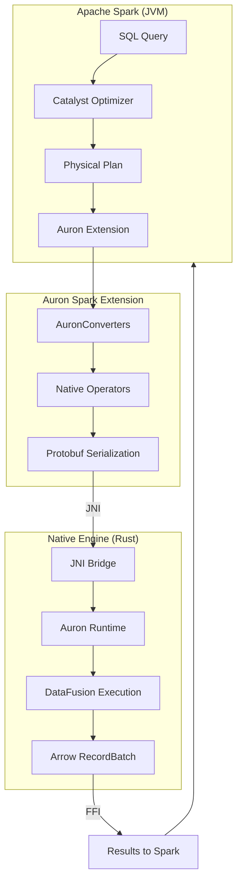
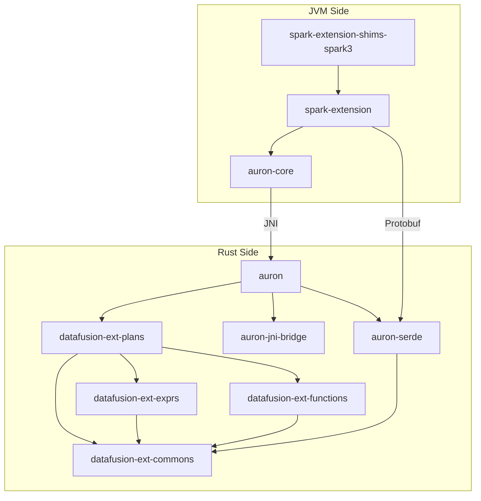

# Apache Auron Architecture Documentation

> **Single-file version** - All architecture documentation merged for easy reference and LLM analysis.
>
> **Contents**: System Overview | Module Guide | Critical Paths | Extension Guide | Glossary

---


---


# Auron System Overview

## What is Auron?

Apache Auron is a **native vectorized execution accelerator** for Apache Spark. It replaces Spark's row-based execution with columnar, vectorized processing powered by Apache DataFusion (a Rust-based query engine) and Apache Arrow (a columnar memory format).

### Why Auron Exists

Spark's default execution model processes data row-by-row in the JVM. This approach has limitations:

| Challenge | Spark's Approach | Auron's Solution |
|-----------|------------------|------------------|
| Memory overhead | JVM objects with headers | Arrow columnar format (no overhead) |
| CPU efficiency | Row-at-a-time processing | Vectorized batch processing |
| JVM limitations | GC pauses, memory management | Native Rust with manual memory control |
| SIMD utilization | Limited JIT optimization | Explicit SIMD via DataFusion |

### Key Benefits

1. **Performance**: 2-10x faster query execution for supported operators
2. **Memory efficiency**: Reduced GC pressure and memory footprint
3. **Transparency**: Works with existing Spark SQL queries without code changes
4. **Compatibility**: Falls back to Spark execution for unsupported operations

## High-Level Architecture



### Components

| Component | Language | Purpose |
|-----------|----------|---------|
| **spark-extension** | Scala | Base classes for native operators, converters |
| **spark-extension-shims-spark3** | Scala | Spark 3.x version-specific implementations |
| **auron-core** | Java | JNI bridge, memory management, configuration |
| **native-engine/auron** | Rust | Main entry point, runtime coordination |
| **native-engine/auron-serde** | Rust | Protobuf serialization/deserialization |
| **native-engine/datafusion-ext-plans** | Rust | Custom DataFusion physical plan operators |
| **native-engine/datafusion-ext-exprs** | Rust | Custom expression implementations |
| **native-engine/auron-jni-bridge** | Rust | JNI utilities and macros |

## Data Flow

### Query Execution Flow

```
┌─────────────────────────────────────────────────────────────────────────┐
│ 1. SPARK QUERY PLANNING                                                  │
│    User submits SQL: SELECT * FROM t WHERE x > 10                       │
│    ↓                                                                     │
│    Catalyst creates optimized Physical Plan                              │
│    ↓                                                                     │
│    AuronSparkSessionExtension intercepts via ColumnarRule               │
└─────────────────────────────────────────────────────────────────────────┘
                                    ↓
┌─────────────────────────────────────────────────────────────────────────┐
│ 2. PLAN CONVERSION (Scala)                                               │
│    AuronConverters.convertSparkPlanRecursively()                        │
│    ↓                                                                     │
│    Each SparkPlan node → NativeXxxExec (e.g., FilterExec → NativeFilter)│
│    ↓                                                                     │
│    Expressions converted via NativeConverters.convertExpr()             │
└─────────────────────────────────────────────────────────────────────────┘
                                    ↓
┌─────────────────────────────────────────────────────────────────────────┐
│ 3. NATIVE PLAN SERIALIZATION                                             │
│    NativeXxxBase.doExecuteNative() creates NativeRDD                    │
│    ↓                                                                     │
│    Plan serialized to Protobuf (PhysicalPlanNode)                       │
│    ↓                                                                     │
│    NativeRDD.compute() called per partition                             │
└─────────────────────────────────────────────────────────────────────────┘
                                    ↓
┌─────────────────────────────────────────────────────────────────────────┐
│ 4. JNI BOUNDARY CROSSING                                                 │
│    AuronCallNativeWrapper created for each partition                    │
│    ↓                                                                     │
│    JniBridge.callNative() → Rust entry point                            │
│    ↓                                                                     │
│    TaskDefinition (protobuf) passed to Rust                             │
└─────────────────────────────────────────────────────────────────────────┘
                                    ↓
┌─────────────────────────────────────────────────────────────────────────┐
│ 5. RUST NATIVE EXECUTION                                                 │
│    NativeExecutionRuntime deserializes plan                             │
│    ↓                                                                     │
│    from_proto.rs converts Protobuf → DataFusion ExecutionPlan           │
│    ↓                                                                     │
│    DataFusion executes plan, produces Arrow RecordBatches               │
└─────────────────────────────────────────────────────────────────────────┘
                                    ↓
┌─────────────────────────────────────────────────────────────────────────┐
│ 6. RESULT RETURN (Arrow FFI)                                             │
│    JniBridge.nextBatch() returns Arrow data via FFI pointers            │
│    ↓                                                                     │
│    AuronCallNativeWrapper.importBatch() deserializes Arrow              │
│    ↓                                                                     │
│    AuronColumnarBatchRow converts to Spark InternalRow                  │
│    ↓                                                                     │
│    Iterator[InternalRow] returned to Spark                              │
└─────────────────────────────────────────────────────────────────────────┘
```

### Memory Flow

```
┌─────────────────┐         ┌─────────────────┐
│   JVM Heap      │         │  Native Memory  │
│                 │         │                 │
│  Spark Objects  │         │  Arrow Buffers  │
│  Task Context   │◄───────▶│  Rust Structs   │
│  Metrics        │   FFI   │  DataFusion     │
│                 │         │                 │
└─────────────────┘         └─────────────────┘
         │                           │
         ▼                           ▼
   OnHeapSpillManager         MemManager (spill to disk)
```

## Supported Operations

### Operators

| Operator | Support | Notes |
|----------|---------|-------|
| Filter | ✅ Full | All predicate types |
| Project | ✅ Full | Column selection, expressions |
| Sort | ✅ Full | Multi-column, nulls ordering |
| Aggregate | ✅ Full | Hash and Sort aggregation |
| Join | ✅ Full | Sort-merge, broadcast, hash |
| Scan (Parquet) | ✅ Full | Predicate pushdown, column pruning |
| Scan (ORC) | ✅ Full | Similar to Parquet |
| Exchange (Shuffle) | ✅ Full | Native shuffle writer |
| Window | ✅ Full | Row number, rank, dense_rank |
| Union | ✅ Full | Union all |
| Limit | ✅ Full | Global and local limits |
| Expand | ✅ Full | For ROLLUP/CUBE |
| Generate | ✅ Full | explode, posexplode |

### Expressions

| Category | Examples | Support |
|----------|----------|---------|
| Arithmetic | +, -, *, /, % | ✅ |
| Comparison | =, <>, <, >, <=, >= | ✅ |
| Logical | AND, OR, NOT | ✅ |
| String | substring, concat, like, trim | ✅ |
| Date/Time | date_add, date_sub, to_date | ✅ |
| Aggregate | count, sum, avg, min, max | ✅ |
| Cast | CAST expressions | ✅ |
| Case | CASE WHEN | ✅ |
| Null | IS NULL, COALESCE | ✅ |

### Data Types

| Type | Support | Notes |
|------|---------|-------|
| Boolean | ✅ | |
| Byte, Short, Int, Long | ✅ | |
| Float, Double | ✅ | |
| Decimal | ✅ | 64-bit precision |
| String | ✅ | |
| Date, Timestamp | ✅ | |
| Array | ✅ | |
| Map | ✅ | |
| Struct | ✅ | |

## Configuration

### Enabling Auron

```scala
spark.conf.set("spark.auron.enable", "true")  // Default: true
```

### Key Configuration Options

| Option | Default | Description |
|--------|---------|-------------|
| `spark.auron.enable` | true | Enable/disable Auron |
| `spark.auron.memory.fraction` | 0.6 | Fraction of executor memory for native |
| `spark.auron.enable.scan` | true | Enable native scans |
| `spark.auron.enable.project` | true | Enable native projections |
| `spark.auron.enable.filter` | true | Enable native filters |
| `spark.auron.enable.sort` | true | Enable native sorts |
| `spark.auron.enable.aggregate` | true | Enable native aggregations |
| `spark.auron.enable.join` | true | Enable native joins |

## Fallback Behavior

When an operation cannot be executed natively, Auron automatically falls back to Spark execution:

```
Native Plan                 Fallback Point           Spark Execution
     │                           │                         │
     ▼                           ▼                         ▼
┌─────────┐              ┌──────────────┐           ┌─────────┐
│ Native  │              │ ConvertTo-   │           │ Spark   │
│ Filter  │─────────────▶│ Native/      │──────────▶│ Join    │
│         │              │ ConvertFrom- │           │ (row)   │
└─────────┘              │ Native       │           └─────────┘
                         └──────────────┘
```

Common fallback reasons:
- Unsupported expression types
- Complex UDFs without native implementation
- Data types without Arrow mapping
- Operations requiring non-deterministic behavior

## Next Steps

- **Module Deep Dives**: See [MODULE-GUIDE.md](MODULE-GUIDE.md) for detailed component documentation
- **Execution Paths**: See [CRITICAL-PATHS.md](CRITICAL-PATHS.md) for code-level tracing
- **Contributing**: See [EXTENSION-GUIDE.md](EXTENSION-GUIDE.md) and [CONTRIBUTING.md](../../CONTRIBUTING.md)


---


# Auron Module Deep Dives

This document provides detailed information about each module in the Auron codebase, including purpose, key files, abstractions, dependencies, and entry points.

## Module Dependency Graph



---

## 1. Spark Extension Layer (spark-extension)

### Purpose
The core Scala module that integrates Auron with Apache Spark. Contains base classes for all native operators, expression converters, and the main extension hook.

### Location
`spark-extension/src/main/scala/org/apache/spark/sql/`

### Key Files

| File | Purpose | Start Here? |
|------|---------|-------------|
| `auron/AuronSparkSessionExtension.scala` | Main entry point, Spark extension hook | ✅ Yes |
| `auron/AuronColumnarOverrides.scala` | ColumnarRule that triggers conversion | ✅ Yes |
| `auron/AuronConverters.scala` | Converts SparkPlan to native operators | ✅ Yes |
| `auron/AuronConvertStrategy.scala` | Analyzes plan convertibility | |
| `auron/NativeConverters.scala` | Converts expressions to Protobuf | |
| `auron/NativeRDD.scala` | RDD wrapper for native execution | |
| `auron/NativeHelper.scala` | Utility functions for native execution | |
| `auron/AuronCallNativeWrapper.scala` | Manages single native task execution | |
| `auron/Shims.scala` | Version abstraction interface | |
| `execution/auron/plan/*.scala` | Base classes for all native operators | |

### Core Abstractions

#### AuronSparkSessionExtension
```scala
// spark-extension/.../auron/AuronSparkSessionExtension.scala:30
class AuronSparkSessionExtension extends (SparkSessionExtensions => Unit) {
  override def apply(extensions: SparkSessionExtensions): Unit = {
    // Inject columnar override rule
    extensions.injectColumnar(_ => AuronColumnarOverrides)
  }
}
```

#### NativeSupports Trait
```scala
// spark-extension/.../auron/NativeSupports.scala
trait NativeSupports extends SparkPlan {
  // Override this to generate native plan
  protected def doExecuteNative(): NativeRDD

  // Standard execution routes through native
  override protected def doExecute(): RDD[InternalRow] = doExecuteNative()
}
```

#### AuronConverters Object
```scala
// spark-extension/.../auron/AuronConverters.scala:50
object AuronConverters {
  // Main entry point for plan conversion
  def convertSparkPlanRecursively(plan: SparkPlan): SparkPlan = {
    // Pattern match on SparkPlan types
    // Convert supported operators to NativeXxxExec
    // Recursively process children
  }
}
```

### Dependencies
- **Depends on**: Apache Spark core, auron-core
- **Depended by**: spark-extension-shims-spark3

### Entry Points
1. `AuronSparkSessionExtension.apply()` - Called by Spark to register extension
2. `AuronColumnarOverrides.preColumnarTransitions()` - Triggers plan conversion
3. `AuronConverters.convertSparkPlanRecursively()` - Recursive plan conversion

---

## 2. Spark Extension Shims (spark-extension-shims-spark3)

### Purpose
Contains Spark 3.x version-specific implementations of native operators. Handles API differences between Spark 3.0, 3.1, 3.2, 3.3, 3.4, and 3.5.

### Location
`spark-extension-shims-spark3/src/main/scala/org/apache/spark/sql/`

### Key Files

| File | Purpose | Start Here? |
|------|---------|-------------|
| `auron/ShimsImpl.scala` | Version-specific factory implementation | ✅ Yes |
| `execution/auron/plan/*.scala` | Concrete operator implementations | ✅ Yes |

### Core Abstractions

#### ShimsImpl
```scala
// spark-extension-shims-spark3/.../auron/ShimsImpl.scala
class ShimsImpl extends Shims {
  // Factory methods for all native operators
  override def createNativeFilterExec(condition: Expression, child: SparkPlan): SparkPlan =
    NativeFilterExec(condition, child)

  override def createNativeProjectExec(projectList: Seq[NamedExpression], child: SparkPlan): SparkPlan =
    NativeProjectExec(projectList, child)

  // ... factories for all operators
}
```

#### Concrete Operators
```scala
// spark-extension-shims-spark3/.../plan/NativeFilterExec.scala
case class NativeFilterExec(condition: Expression, override val child: SparkPlan)
    extends NativeFilterBase(condition, child) {

  // Spark 3.2+ requires withNewChildInternal
  override protected def withNewChildInternal(newChild: SparkPlan): SparkPlan =
    copy(child = newChild)
}
```

### Version Differences Handled
- `withNewChildInternal()` (Spark 3.2+) vs `withNewChildren()` (Spark 3.0/3.1)
- Column statistics API changes
- Adaptive query execution API evolution
- Expression evaluation changes

### Dependencies
- **Depends on**: spark-extension (base classes)
- **Depended by**: None (end of dependency chain)

### Entry Points
1. `Shims.get` loads `ShimsImpl` via reflection
2. `ShimsImpl.createXxx()` factory methods create operators

---

## 3. Protobuf Serialization (auron-serde)

### Purpose
Defines the Protocol Buffer schema for serializing execution plans and expressions. Provides Rust serialization/deserialization code.

### Location
`native-engine/auron-serde/`

### Key Files

| File | Purpose | Start Here? |
|------|---------|-------------|
| `proto/auron.proto` | Main Protobuf schema definition | ✅ Yes |
| `src/from_proto.rs` | Deserialize Protobuf to Rust types | ✅ Yes |
| `src/to_proto.rs` | Serialize Rust types to Protobuf | |
| `src/lib.rs` | Module exports | |
| `build.rs` | Code generation during build | |

### Core Abstractions

#### PhysicalPlanNode (Protobuf)
```protobuf
// native-engine/auron-serde/proto/auron.proto:50
message PhysicalPlanNode {
  oneof PhysicalPlanType {
    FilterExecNode filter = 8;
    ProjectionExecNode projection = 7;
    SortExecNode sort = 9;
    AggExecNode agg = 17;
    SortMergeJoinExecNode sort_merge_join = 13;
    HashJoinExecNode hash_join = 14;
    ParquetScanExecNode parquet_scan = 5;
    OrcScanExecNode orc_scan = 6;
    ShuffleWriterExecNode shuffle_writer = 2;
    // ... 20+ operator types
  }
}
```

#### PhysicalExprNode (Protobuf)
```protobuf
// native-engine/auron-serde/proto/auron.proto:150
message PhysicalExprNode {
  oneof ExprType {
    PhysicalColumn column = 1;
    ScalarValue literal = 2;
    PhysicalBinaryExprNode binary_expr = 4;
    PhysicalCastNode cast = 6;
    PhysicalCaseNode case_ = 8;
    PhysicalScalarFunctionNode scalar_function = 9;
    PhysicalAggExprNode agg_expr = 10;
    // ... 30+ expression types
  }
}
```

#### from_proto Module
```rust
// native-engine/auron-serde/src/from_proto.rs:100
pub fn convert_physical_plan(
    plan: &PhysicalPlanNode,
    ctx: &SessionContext,
) -> Result<Arc<dyn ExecutionPlan>> {
    match &plan.physical_plan_type {
        Some(PhysicalPlanType::Filter(filter)) => {
            let input = convert_physical_plan(filter.input.as_ref().unwrap(), ctx)?;
            let predicates = filter.expr.iter()
                .map(|e| convert_physical_expr(e, input.schema()))
                .collect::<Result<Vec<_>>>()?;
            Ok(Arc::new(FilterExec::new(predicates, input)))
        }
        // ... match arms for all operator types
    }
}
```

### Dependencies
- **Depends on**: datafusion-ext-commons, prost (protobuf library)
- **Depended by**: auron (main runtime)

### Entry Points
1. Protobuf schema defines serialization format
2. `from_proto::convert_physical_plan()` - Plan deserialization
3. `from_proto::convert_physical_expr()` - Expression deserialization

---

## 4. JNI Bridge Layer

This spans two locations: Java/Scala side and Rust side.

### Java Side (auron-core)

#### Purpose
Provides the Java interface for calling into native Rust code via JNI.

#### Location
`auron-core/src/main/java/org/apache/auron/`

#### Key Files

| File | Purpose | Start Here? |
|------|---------|-------------|
| `jni/JniBridge.java` | JNI native method declarations | ✅ Yes |
| `jni/AuronAdaptor.java` | Abstract adaptor for Auron engine | ✅ Yes |
| `conf/AuronConf.java` | Configuration handling | |
| `memory/OnHeapSpillManager.java` | JVM memory management | |

#### Core Abstractions

```java
// auron-core/.../jni/JniBridge.java:20
public class JniBridge {
    // Start native execution, returns runtime pointer
    public static native long callNative(
        long initNativeMemory,
        String logLevel,
        AuronCallNativeWrapper wrapper);

    // Get next Arrow batch
    public static native boolean nextBatch(long ptr);

    // Release native resources
    public static native void finalizeNative(long ptr);

    // Cleanup on JVM exit
    public static native void onExit();
}
```

### Rust Side (auron-jni-bridge)

#### Purpose
Rust utilities for JNI interop: thread-local JNI environment, local reference management, Java class caching.

#### Location
`native-engine/auron-jni-bridge/src/`

#### Key Files

| File | Purpose | Start Here? |
|------|---------|-------------|
| `jni_bridge.rs` | JNI utilities and thread-local env | ✅ Yes |
| `lib.rs` | Module exports | |

#### Core Abstractions

```rust
// native-engine/auron-jni-bridge/src/jni_bridge.rs:30
thread_local! {
    // Thread-local JNI environment
    pub static THREAD_JNIENV: RefCell<Option<*mut JNIEnv>> = RefCell::new(None);
}

// RAII wrapper for JNI local references
pub struct LocalRef<'a> {
    obj: JObject<'a>,
    env: &'a JNIEnv<'a>,
}

// Cached Java class references
pub struct JavaClasses {
    pub auron_call_native_wrapper: GlobalRef,
    pub runtime_exception: GlobalRef,
    // ... other cached classes
}
```

### JNI Call Flow
```
JVM                                 Rust
 │                                   │
 │  JniBridge.callNative()          │
 │ ─────────────────────────────────▶│
 │                                   │ Java_org_apache_spark_sql_auron_
 │                                   │   JniBridge_callNative()
 │                                   │ ─────▶ init_jni_bridge()
 │                                   │ ─────▶ create NativeExecutionRuntime
 │  returns: long (runtime ptr)      │
 │ ◀─────────────────────────────────│
 │                                   │
 │  JniBridge.nextBatch(ptr)        │
 │ ─────────────────────────────────▶│
 │                                   │ execute_plan()
 │                                   │ produce Arrow batch
 │                                   │ call wrapper.importBatch()
 │  returns: boolean (has more)      │
 │ ◀─────────────────────────────────│
 │                                   │
 │  JniBridge.finalizeNative(ptr)   │
 │ ─────────────────────────────────▶│
 │                                   │ drop NativeExecutionRuntime
 │ ◀─────────────────────────────────│
```

### Dependencies
- **Java depends on**: JNI libraries
- **Rust depends on**: jni crate
- **Depended by**: auron (main runtime)

---

## 5. Rust Execution Engine (auron)

### Purpose
Main Rust crate that coordinates native execution. Contains JNI entry points, runtime management, and DataFusion session configuration.

### Location
`native-engine/auron/src/`

### Key Files

| File | Purpose | Start Here? |
|------|---------|-------------|
| `lib.rs` | JNI entry points, runtime init | ✅ Yes |
| `rt.rs` | NativeExecutionRuntime definition | ✅ Yes |
| `exec.rs` | Plan execution logic | |
| `logging.rs` | Logging configuration | |

### Core Abstractions

#### JNI Entry Point
```rust
// native-engine/auron/src/lib.rs:50
#[no_mangle]
pub extern "system" fn Java_org_apache_spark_sql_auron_JniBridge_callNative(
    env: JNIEnv,
    _class: JClass,
    executor_memory_overhead: i64,
    log_level: JString,
    native_wrapper: JObject,
) -> i64 {
    // 1. Initialize JNI bridge
    // 2. Create DataFusion SessionContext
    // 3. Create NativeExecutionRuntime
    // 4. Return pointer as i64
}
```

#### NativeExecutionRuntime
```rust
// native-engine/auron/src/rt.rs:30
pub struct NativeExecutionRuntime {
    // DataFusion session with configuration
    pub session_ctx: SessionContext,

    // The execution plan to run
    pub plan: Arc<dyn ExecutionPlan>,

    // Current partition being processed
    pub partition: usize,

    // Batch stream from execution
    pub stream: Option<SendableRecordBatchStream>,

    // JNI callback wrapper
    pub native_wrapper: GlobalRef,
}
```

### Dependencies
- **Depends on**: auron-serde, auron-jni-bridge, datafusion-ext-plans, DataFusion
- **Depended by**: None (top of Rust dependency chain)

### Entry Points
1. `Java_org_apache_spark_sql_auron_JniBridge_callNative` - Start execution
2. `Java_org_apache_spark_sql_auron_JniBridge_nextBatch` - Get next batch
3. `Java_org_apache_spark_sql_auron_JniBridge_finalizeNative` - Cleanup

---

## 6. DataFusion Extensions (datafusion-ext-*)

### Purpose
Custom DataFusion physical plan operators and expressions that extend DataFusion's capabilities for Spark compatibility.

### Location
`native-engine/datafusion-ext-plans/src/` and related crates

### Key Files

| Crate | Key Files | Purpose |
|-------|-----------|---------|
| **datafusion-ext-plans** | | |
| | `lib.rs` | Module exports |
| | `agg/agg_exec.rs` | Hash/Sort aggregation |
| | `filter_exec.rs` | Filter execution |
| | `project_exec.rs` | Projection execution |
| | `sort_exec.rs` | Sort execution |
| | `sort_merge_join_exec.rs` | Sort-merge join |
| | `broadcast_join_exec.rs` | Broadcast join |
| | `shuffle_writer_exec.rs` | Shuffle write |
| | `parquet_exec.rs` | Parquet scan |
| | `window/` | Window functions |
| | `memmgr/` | Memory management |
| **datafusion-ext-exprs** | | |
| | `lib.rs` | Expression exports |
| | `cast.rs` | Cast expressions |
| | `string_funcs.rs` | String functions |
| | `datetime_funcs.rs` | Date/time functions |
| **datafusion-ext-functions** | | |
| | `lib.rs` | SQL function registry |
| **datafusion-ext-commons** | | |
| | `lib.rs` | Shared utilities |

### Core Abstractions

#### Custom ExecutionPlan
```rust
// native-engine/datafusion-ext-plans/src/filter_exec.rs:20
#[derive(Debug)]
pub struct FilterExec {
    /// Filter predicates
    predicates: Vec<Arc<dyn PhysicalExpr>>,
    /// Input execution plan
    input: Arc<dyn ExecutionPlan>,
    /// Output schema (same as input for filter)
    schema: SchemaRef,
    /// Metrics
    metrics: ExecutionPlanMetricsSet,
}

impl ExecutionPlan for FilterExec {
    fn execute(
        &self,
        partition: usize,
        context: Arc<TaskContext>,
    ) -> Result<SendableRecordBatchStream> {
        // Execute input plan
        // Apply filter predicates to each batch
        // Return filtered stream
    }
}
```

#### Aggregation System
```rust
// native-engine/datafusion-ext-plans/src/agg/agg_exec.rs:50
pub enum AggExecMode {
    HashAgg,  // Hash-based aggregation
    SortAgg,  // Sort-based aggregation
}

pub struct AggExec {
    mode: AggExecMode,
    group_by: Vec<Arc<dyn PhysicalExpr>>,
    aggr_exprs: Vec<Arc<dyn AggregateExpr>>,
    input: Arc<dyn ExecutionPlan>,
    // ...
}
```

### Dependencies
- **datafusion-ext-plans depends on**: DataFusion, datafusion-ext-exprs, datafusion-ext-functions, datafusion-ext-commons
- **datafusion-ext-exprs depends on**: DataFusion, datafusion-ext-commons
- **datafusion-ext-functions depends on**: DataFusion, datafusion-ext-commons
- **datafusion-ext-commons depends on**: Arrow, DataFusion (minimal)

### Entry Points
1. Operators registered via `from_proto.rs` deserialization
2. Direct instantiation in Rust code for testing

---

## Module Summary

| Module | Language | Lines of Code* | Primary Responsibility |
|--------|----------|----------------|------------------------|
| spark-extension | Scala | ~15,000 | Spark integration, base operators |
| spark-extension-shims-spark3 | Scala | ~5,000 | Spark 3.x compatibility |
| auron-core | Java | ~3,000 | JNI bridge, configuration |
| auron | Rust | ~2,000 | Runtime coordination |
| auron-serde | Rust | ~4,000 | Protobuf serialization |
| auron-jni-bridge | Rust | ~1,000 | JNI utilities |
| datafusion-ext-plans | Rust | ~20,000 | Physical operators |
| datafusion-ext-exprs | Rust | ~5,000 | Expression evaluation |
| datafusion-ext-functions | Rust | ~2,000 | SQL functions |
| datafusion-ext-commons | Rust | ~3,000 | Shared utilities |

*Approximate, for relative comparison

---

## Next Steps

- **Trace execution paths**: See [CRITICAL-PATHS.md](CRITICAL-PATHS.md)
- **Add new operators**: See [EXTENSION-GUIDE.md](EXTENSION-GUIDE.md)
- **Key terms**: See [GLOSSARY.md](GLOSSARY.md)


---


# Critical Execution Paths

This document traces end-to-end code paths through the Auron system with specific file and line references.

## Path 1: Query Conversion (SparkPlan → NativeExec → Protobuf)

This path shows how a Spark physical plan is converted to native execution.

### Step 1: Extension Registration

```
File: spark-extension/src/main/scala/org/apache/spark/sql/auron/AuronSparkSessionExtension.scala

class AuronSparkSessionExtension extends (SparkSessionExtensions => Unit) {
  override def apply(extensions: SparkSessionExtensions): Unit = {
    if (conf.auronEnabled) {
      extensions.injectColumnar(_ => AuronColumnarOverrides)
      // Forces adaptive execution for better plan optimization
      SparkSession.builder().enableHiveSupport()
    }
  }
}
```

### Step 2: Columnar Rule Triggers

```
File: spark-extension/src/main/scala/org/apache/spark/sql/auron/AuronColumnarOverrides.scala

object AuronColumnarOverrides extends ColumnarRule {
  override def preColumnarTransitions(plan: SparkPlan): SparkPlan = {
    // 1. Analyze plan convertibility
    AuronConvertStrategy.apply(plan)

    // 2. Convert to native operators
    val converted = AuronConverters.convertSparkPlanRecursively(plan)

    // 3. Apply version-specific transforms
    Shims.get.postTransform(converted)
  }
}
```

### Step 3: Plan Analysis

```
File: spark-extension/src/main/scala/org/apache/spark/sql/auron/AuronConvertStrategy.scala

object AuronConvertStrategy {
  def apply(plan: SparkPlan): Unit = {
    // Tag each node with convertibility
    plan.foreach { node =>
      val canConvert = analyzeConvertibility(node)
      node.setTagValue(convertibleTag, canConvert)
      if (!canConvert) {
        node.setTagValue(neverConvertReasonTag, reason)
      }
    }
  }

  private def analyzeConvertibility(node: SparkPlan): Boolean = {
    // Check operator type support
    // Check expression support
    // Check data type support
    // Propagate from children
  }
}
```

### Step 4: Recursive Conversion

```
File: spark-extension/src/main/scala/org/apache/spark/sql/auron/AuronConverters.scala

object AuronConverters {
  def convertSparkPlanRecursively(plan: SparkPlan): SparkPlan = {
    plan match {
      case filter: FilterExec if canConvert(filter) =>
        val nativeChild = convertSparkPlanRecursively(filter.child)
        Shims.get.createNativeFilterExec(filter.condition, nativeChild)

      case project: ProjectExec if canConvert(project) =>
        val nativeChild = convertSparkPlanRecursively(project.child)
        Shims.get.createNativeProjectExec(project.projectList, nativeChild)

      case agg: HashAggregateExec if canConvert(agg) =>
        // Convert to NativeAggExec
        convertAggregate(agg)

      case join: SortMergeJoinExec if canConvert(join) =>
        // Convert to NativeSortMergeJoinExec
        convertSortMergeJoin(join)

      // ... more operator patterns

      case other =>
        // Not convertible, keep as Spark operator
        other.withNewChildren(other.children.map(convertSparkPlanRecursively))
    }
  }
}
```

### Step 5: Shims Creates Concrete Operator

```
File: spark-extension-shims-spark3/src/main/scala/org/apache/spark/sql/auron/ShimsImpl.scala

class ShimsImpl extends Shims {
  override def createNativeFilterExec(
      condition: Expression,
      child: SparkPlan): SparkPlan = {
    NativeFilterExec(condition, child)
  }
}

File: spark-extension-shims-spark3/.../plan/NativeFilterExec.scala

case class NativeFilterExec(condition: Expression, override val child: SparkPlan)
    extends NativeFilterBase(condition, child) {

  override protected def withNewChildInternal(newChild: SparkPlan): SparkPlan =
    copy(child = newChild)
}
```

### Step 6: Base Class Generates Protobuf

```
File: spark-extension/src/main/scala/org/apache/spark/sql/execution/auron/plan/NativeFilterBase.scala

abstract class NativeFilterBase(condition: Expression, override val child: SparkPlan)
    extends UnaryExecNode with NativeSupports {

  override def doExecuteNative(): NativeRDD = {
    val inputRDD = NativeHelper.executeNative(child)
    val metrics = MetricNode(getDefaultNativeMetrics(), Nil)

    new NativeRDD(
      sparkContext,
      metrics,
      inputRDD.partitions,
      inputRDD.dependencies,
      (partition, taskContext) => {
        // This closure is called per-partition
        val inputPlan = inputRDD.nativePlan(partition, taskContext)

        // Convert condition to Protobuf expression
        val filterExpr = NativeConverters.convertExpr(condition)

        // Create FilterExecNode protobuf message
        pb.PhysicalPlanNode.newBuilder()
          .setFilter(
            pb.FilterExecNode.newBuilder()
              .setInput(inputPlan)
              .addExpr(filterExpr)
          )
          .build()
      }
    )
  }
}
```

### Step 7: Expression Conversion

```
File: spark-extension/src/main/scala/org/apache/spark/sql/auron/NativeConverters.scala

object NativeConverters {
  def convertExpr(expr: Expression): pb.PhysicalExprNode = {
    expr match {
      case attr: AttributeReference =>
        pb.PhysicalExprNode.newBuilder()
          .setColumn(pb.PhysicalColumn.newBuilder()
            .setName(attr.name)
            .setIndex(attr.exprId.id.toInt))
          .build()

      case lit: Literal =>
        pb.PhysicalExprNode.newBuilder()
          .setLiteral(convertLiteral(lit))
          .build()

      case BinaryComparison(left, right) =>
        pb.PhysicalExprNode.newBuilder()
          .setBinaryExpr(pb.PhysicalBinaryExprNode.newBuilder()
            .setL(convertExpr(left))
            .setR(convertExpr(right))
            .setOp(convertOperator(expr)))
          .build()

      // ... more expression patterns
    }
  }
}
```

---

## Path 2: Execution (JNI → Rust Deserialization → DataFusion)

This path traces how a serialized plan is executed in the native engine.

### Step 1: NativeRDD Compute

```
File: spark-extension/src/main/scala/org/apache/spark/sql/auron/NativeRDD.scala

class NativeRDD(
    @transient private val _sc: SparkContext,
    metrics: MetricNode,
    partitions: Array[Partition],
    deps: Seq[Dependency[_]],
    nativePlan: (Partition, TaskContext) => pb.PhysicalPlanNode
) extends RDD[InternalRow](_sc, deps) {

  override def compute(split: Partition, context: TaskContext): Iterator[InternalRow] = {
    // Generate plan for this partition
    val plan = nativePlan(split, context)

    // Execute via native helper
    NativeHelper.executeNativePlan(plan, metrics, context)
  }
}
```

### Step 2: Native Helper Execution

```
File: spark-extension/src/main/scala/org/apache/spark/sql/auron/NativeHelper.scala

object NativeHelper {
  def executeNativePlan(
      plan: pb.PhysicalPlanNode,
      metrics: MetricNode,
      context: TaskContext): Iterator[InternalRow] = {

    // Create task definition
    val taskDef = pb.TaskDefinition.newBuilder()
      .setPlan(plan)
      .setTaskId(context.taskAttemptId())
      .setPartitionId(context.partitionId())
      .build()

    // Create native wrapper
    val wrapper = new AuronCallNativeWrapper(
      taskDef.toByteArray,
      metrics,
      context
    )

    // Return row iterator
    wrapper.getRowIterator
  }
}
```

### Step 3: JNI Call Initialization

```
File: spark-extension/src/main/scala/org/apache/spark/sql/auron/AuronCallNativeWrapper.scala

class AuronCallNativeWrapper(
    taskDefBytes: Array[Byte],
    metrics: MetricNode,
    context: TaskContext) {

  // Load native library
  AuronAdaptor.loadAuronLib()

  // Initialize native execution
  private val runtimePtr: Long = JniBridge.callNative(
    NativeHelper.nativeMemory,
    logLevel,
    this  // Pass wrapper for callbacks
  )

  def getRowIterator: Iterator[InternalRow] = {
    new Iterator[InternalRow] {
      private var currentBatch: ColumnarBatch = _
      private var rowIndex: Int = 0

      override def hasNext: Boolean = {
        if (rowIndex < currentBatch.numRows()) {
          true
        } else {
          // Get next batch from native
          if (JniBridge.nextBatch(runtimePtr)) {
            rowIndex = 0
            true
          } else {
            false
          }
        }
      }

      override def next(): InternalRow = {
        val row = currentBatch.getRow(rowIndex)
        rowIndex += 1
        row
      }
    }
  }

  // Called from Rust via JNI
  def importSchema(ffiSchemaPtr: Long): Unit = {
    schema = ArrowSchema.import(ffiSchemaPtr)
  }

  // Called from Rust via JNI
  def importBatch(ffiArrayPtr: Long): Unit = {
    val batch = ArrowRecordBatch.import(ffiArrayPtr, schema)
    currentBatch = toColumnarBatch(batch)
  }
}
```

### Step 4: Rust JNI Entry Point

```
File: native-engine/auron/src/lib.rs

#[no_mangle]
pub extern "system" fn Java_org_apache_spark_sql_auron_JniBridge_callNative(
    env: JNIEnv,
    _class: JClass,
    executor_memory_overhead: i64,
    log_level: JString,
    native_wrapper: JObject,
) -> i64 {
    // Set up thread-local JNI environment
    jni_bridge::set_thread_jnienv(env);

    // Initialize logging
    init_logging(&log_level);

    // Create DataFusion session context
    let session_ctx = create_session_context(executor_memory_overhead);

    // Get task definition from wrapper
    let task_def_bytes = get_task_definition(env, &native_wrapper);

    // Deserialize protobuf
    let task_def: TaskDefinition = TaskDefinition::decode(&task_def_bytes[..])?;

    // Convert to DataFusion plan
    let plan = from_proto::convert_physical_plan(&task_def.plan, &session_ctx)?;

    // Create runtime
    let runtime = NativeExecutionRuntime::new(
        session_ctx,
        plan,
        task_def.partition_id as usize,
        GlobalRef::new(env, native_wrapper),
    );

    // Return pointer
    Box::into_raw(Box::new(runtime)) as i64
}
```

### Step 5: Protobuf Deserialization

```
File: native-engine/auron-serde/src/from_proto.rs

pub fn convert_physical_plan(
    plan: &PhysicalPlanNode,
    ctx: &SessionContext,
) -> Result<Arc<dyn ExecutionPlan>> {
    use plan::PhysicalPlanType::*;

    match plan.physical_plan_type.as_ref().unwrap() {
        Filter(filter) => {
            // Recursively convert input plan
            let input = convert_physical_plan(
                filter.input.as_ref().unwrap(),
                ctx
            )?;

            // Convert filter predicates
            let predicates: Vec<Arc<dyn PhysicalExpr>> = filter.expr
                .iter()
                .map(|e| convert_physical_expr(e, input.schema()))
                .collect::<Result<Vec<_>>>()?;

            // Create FilterExec
            Ok(Arc::new(FilterExec::new(predicates, input)))
        }

        Projection(proj) => {
            let input = convert_physical_plan(proj.input.as_ref().unwrap(), ctx)?;
            let exprs = proj.expr
                .iter()
                .map(|e| convert_physical_expr(e, input.schema()))
                .collect::<Result<Vec<_>>>()?;
            Ok(Arc::new(ProjectionExec::new(exprs, input)))
        }

        Agg(agg) => {
            let input = convert_physical_plan(agg.input.as_ref().unwrap(), ctx)?;
            let mode = match agg.mode() {
                AggExecMode::HashAgg => agg::AggExecMode::HashAgg,
                AggExecMode::SortAgg => agg::AggExecMode::SortAgg,
            };
            // ... build AggExec
        }

        // ... more operator conversions
    }
}

pub fn convert_physical_expr(
    expr: &PhysicalExprNode,
    schema: &Schema,
) -> Result<Arc<dyn PhysicalExpr>> {
    use expr::ExprType::*;

    match expr.expr_type.as_ref().unwrap() {
        Column(col) => {
            Ok(Arc::new(Column::new(&col.name, col.index as usize)))
        }

        Literal(lit) => {
            let value = convert_scalar_value(lit)?;
            Ok(Arc::new(Literal::new(value)))
        }

        BinaryExpr(binary) => {
            let left = convert_physical_expr(binary.l.as_ref().unwrap(), schema)?;
            let right = convert_physical_expr(binary.r.as_ref().unwrap(), schema)?;
            let op = convert_operator(&binary.op)?;
            Ok(Arc::new(BinaryExpr::new(left, op, right)))
        }

        // ... more expression conversions
    }
}
```

### Step 6: DataFusion Execution

```
File: native-engine/auron/src/exec.rs

impl NativeExecutionRuntime {
    pub fn next_batch(&mut self) -> Result<bool> {
        // Initialize stream if needed
        if self.stream.is_none() {
            let context = Arc::new(TaskContext::default());
            self.stream = Some(
                self.plan.execute(self.partition, context)?
            );
        }

        // Get next batch from stream
        let stream = self.stream.as_mut().unwrap();
        match futures::executor::block_on(stream.next()) {
            Some(Ok(batch)) => {
                // Export batch to Java via FFI
                self.export_batch_to_java(batch)?;
                Ok(true)
            }
            Some(Err(e)) => Err(e),
            None => Ok(false),
        }
    }
}
```

---

## Path 3: Data Return (Arrow RecordBatch → Spark InternalRow)

### Step 1: Rust Exports Arrow via FFI

```
File: native-engine/auron/src/exec.rs

impl NativeExecutionRuntime {
    fn export_batch_to_java(&self, batch: RecordBatch) -> Result<()> {
        // Get JNI environment
        let env = jni_bridge::get_thread_jnienv();

        // Export schema (first batch only)
        if !self.schema_exported {
            let ffi_schema = FFI_ArrowSchema::try_from(batch.schema().as_ref())?;
            let schema_ptr = Box::into_raw(Box::new(ffi_schema));

            // Call Java: wrapper.importSchema(schemaPtr)
            env.call_method(
                &self.native_wrapper,
                "importSchema",
                "(J)V",
                &[JValue::Long(schema_ptr as i64)]
            )?;
        }

        // Export record batch
        let ffi_array = FFI_ArrowArray::try_from(&batch)?;
        let array_ptr = Box::into_raw(Box::new(ffi_array));

        // Call Java: wrapper.importBatch(arrayPtr)
        env.call_method(
            &self.native_wrapper,
            "importBatch",
            "(J)V",
            &[JValue::Long(array_ptr as i64)]
        )?;

        Ok(())
    }
}
```

### Step 2: Java Imports Arrow Data

```
File: spark-extension/src/main/scala/org/apache/spark/sql/auron/AuronCallNativeWrapper.scala

class AuronCallNativeWrapper(...) {
  private var schema: Schema = _
  private var currentBatch: ColumnarBatch = _

  // Called from Rust
  def importSchema(ffiSchemaPtr: Long): Unit = {
    schema = ArrowSchema.importFromFFI(ffiSchemaPtr)
    // Free the FFI struct after import
    ArrowSchema.freeFFI(ffiSchemaPtr)
  }

  // Called from Rust
  def importBatch(ffiArrayPtr: Long): Unit = {
    val recordBatch = ArrowRecordBatch.importFromFFI(ffiArrayPtr, schema)
    currentBatch = convertToColumnarBatch(recordBatch)
    ArrowRecordBatch.freeFFI(ffiArrayPtr)
  }

  private def convertToColumnarBatch(batch: RecordBatch): ColumnarBatch = {
    val columns = batch.columns.map { array =>
      new AuronArrowColumnVector(array)
    }
    new ColumnarBatch(columns.toArray, batch.numRows)
  }
}
```

### Step 3: Columnar to Row Conversion

```
File: spark-extension/.../columnar/AuronColumnarBatchRow.scala

class AuronColumnarBatchRow(batch: ColumnarBatch, rowId: Int)
    extends InternalRow {

  override def numFields: Int = batch.numCols()

  override def isNullAt(ordinal: Int): Boolean =
    batch.column(ordinal).isNullAt(rowId)

  override def getInt(ordinal: Int): Int =
    batch.column(ordinal).getInt(rowId)

  override def getLong(ordinal: Int): Long =
    batch.column(ordinal).getLong(rowId)

  override def getDouble(ordinal: Int): Double =
    batch.column(ordinal).getDouble(rowId)

  override def getUTF8String(ordinal: Int): UTF8String =
    batch.column(ordinal).getUTF8String(rowId)

  // ... other type accessors
}
```

---

## Path 4: Memory Management

### JVM Side Memory Tracking

```
File: auron-core/src/main/java/org/apache/auron/memory/OnHeapSpillManager.java

public class OnHeapSpillManager {
    private final long maxMemory;
    private final AtomicLong usedMemory = new AtomicLong(0);

    public boolean tryAcquire(long size) {
        while (true) {
            long current = usedMemory.get();
            if (current + size > maxMemory) {
                return false;
            }
            if (usedMemory.compareAndSet(current, current + size)) {
                return true;
            }
        }
    }

    public void release(long size) {
        usedMemory.addAndGet(-size);
    }
}
```

### Rust Side Memory Management

```
File: native-engine/datafusion-ext-plans/src/memmgr/mod.rs

pub struct MemManager {
    /// Total memory limit
    memory_limit: usize,
    /// Currently used memory
    used: AtomicUsize,
    /// Consumers that can spill
    spillable_consumers: Mutex<Vec<Arc<dyn SpillableConsumer>>>,
}

impl MemManager {
    pub fn try_grow(&self, consumer: &impl MemConsumer, size: usize) -> Result<()> {
        let mut attempts = 0;
        loop {
            let current = self.used.load(Ordering::SeqCst);
            if current + size <= self.memory_limit {
                if self.used
                    .compare_exchange(current, current + size, ...)
                    .is_ok()
                {
                    return Ok(());
                }
            } else if attempts < MAX_SPILL_ATTEMPTS {
                // Trigger spill to disk
                self.trigger_spill(size)?;
                attempts += 1;
            } else {
                return Err(Error::OutOfMemory);
            }
        }
    }

    fn trigger_spill(&self, needed: usize) -> Result<usize> {
        let consumers = self.spillable_consumers.lock().unwrap();
        let mut freed = 0;
        for consumer in consumers.iter() {
            freed += consumer.spill(needed - freed)?;
            if freed >= needed {
                break;
            }
        }
        Ok(freed)
    }
}
```

### Memory Flow

```
┌──────────────────────────────────────────────────────────────────┐
│                        Memory Configuration                       │
│                                                                    │
│  Executor Memory = spark.executor.memory                          │
│         │                                                          │
│         ├──▶ JVM Heap                                             │
│         │      └── OnHeapSpillManager (Spark task memory)         │
│         │                                                          │
│         └──▶ Native Memory (spark.auron.memory.fraction)          │
│                └── MemManager (Rust memory pool)                  │
│                      ├── Aggregation buffers                      │
│                      ├── Sort buffers                             │
│                      └── Join hash tables                         │
└──────────────────────────────────────────────────────────────────┘
```

---

## Quick Reference: Key Code Locations

| Operation | File | Function/Class |
|-----------|------|----------------|
| Extension entry | `AuronSparkSessionExtension.scala` | `apply()` |
| Plan conversion | `AuronConverters.scala` | `convertSparkPlanRecursively()` |
| Expression conversion | `NativeConverters.scala` | `convertExpr()` |
| Native plan generation | `NativeXxxBase.scala` | `doExecuteNative()` |
| JNI call (Java) | `JniBridge.java` | `callNative()` |
| JNI entry (Rust) | `lib.rs` | `Java_..._callNative` |
| Plan deserialization | `from_proto.rs` | `convert_physical_plan()` |
| Batch execution | `exec.rs` | `next_batch()` |
| Arrow export | `exec.rs` | `export_batch_to_java()` |
| Arrow import | `AuronCallNativeWrapper.scala` | `importBatch()` |
| Memory management | `memmgr/mod.rs` | `MemManager` |


---


# Auron Extension Guide

This guide covers how to extend Auron with new operators, expressions, data sources, and configuration options.

## Quick Links

- **New Operator**: [Adding a New Operator](#adding-a-new-operator)
- **New Expression**: [Adding a New Expression](#adding-a-new-expression)
- **New Data Source**: [Adding a New Data Source](#adding-a-new-data-source)
- **Configuration**: [Configuration Reference](#configuration-reference)

For detailed operator implementation examples, see [CONTRIBUTING.md](../../CONTRIBUTING.md).

---

## Adding a New Operator

### Overview

Adding a new operator requires changes in 4-5 locations:

```
1. Protobuf schema         → native-engine/auron-serde/proto/auron.proto
2. Scala base class        → spark-extension/.../plan/NativeXxxBase.scala
3. Scala concrete class    → spark-extension-shims-spark3/.../plan/NativeXxxExec.scala
4. Shims factory method    → spark-extension-shims-spark3/.../ShimsImpl.scala
5. Rust execution plan     → native-engine/datafusion-ext-plans/src/xxx_exec.rs
6. Protobuf deserialization → native-engine/auron-serde/src/from_proto.rs
```

### Step 1: Define Protobuf Message

```protobuf
// native-engine/auron-serde/proto/auron.proto

// Add to PhysicalPlanNode oneof (pick next available field number)
message PhysicalPlanNode {
  oneof PhysicalPlanType {
    // ... existing operators ...
    MyOperatorExecNode my_operator = 99;  // Use next available number
  }
}

// Define the operator message
message MyOperatorExecNode {
  // Input plan (most operators have one or two inputs)
  PhysicalPlanNode input = 1;

  // Operator-specific fields
  repeated PhysicalExprNode expressions = 2;
  bool some_flag = 3;
  int32 some_value = 4;
}
```

### Step 2: Create Scala Base Class

```scala
// spark-extension/src/main/scala/org/apache/spark/sql/execution/auron/plan/NativeMyOperatorBase.scala

package org.apache.spark.sql.execution.auron.plan

import org.apache.spark.sql.catalyst.expressions._
import org.apache.spark.sql.execution._
import org.apache.spark.sql.auron._

abstract class NativeMyOperatorBase(
    expressions: Seq[Expression],
    someFlag: Boolean,
    override val child: SparkPlan)
    extends UnaryExecNode
    with NativeSupports
    with Logging {

  // Operator name shown in explain plans
  override val nodeName: String = "NativeMyOperator"

  // Output schema (often same as child for transforms)
  override def output: Seq[Attribute] = child.output

  // Define metrics for monitoring
  override lazy val metrics: Map[String, SQLMetric] =
    NativeHelper.getDefaultNativeMetrics(sparkContext)

  override def doExecuteNative(): NativeRDD = {
    // Get native input RDD from child
    val inputRDD = NativeHelper.executeNative(child)

    // Create metrics node
    val metricsNode = MetricNode(metrics, inputRDD.metrics :: Nil)

    // Create NativeRDD with plan generator
    new NativeRDD(
      sparkContext,
      metricsNode,
      inputRDD.partitions,
      inputRDD.dependencies,
      (partition, taskContext) => {
        // Get input plan
        val inputPlan = inputRDD.nativePlan(partition, taskContext)

        // Convert expressions to protobuf
        val protoExprs = expressions.map(NativeConverters.convertExpr)

        // Build operator node
        pb.PhysicalPlanNode.newBuilder()
          .setMyOperator(
            pb.MyOperatorExecNode.newBuilder()
              .setInput(inputPlan)
              .addAllExpressions(protoExprs.asJava)
              .setSomeFlag(someFlag)
          )
          .build()
      }
    )
  }
}
```

### Step 3: Create Scala Concrete Class

```scala
// spark-extension-shims-spark3/src/main/scala/org/apache/spark/sql/execution/auron/plan/NativeMyOperatorExec.scala

package org.apache.spark.sql.execution.auron.plan

import org.apache.spark.sql.catalyst.expressions._
import org.apache.spark.sql.execution._

case class NativeMyOperatorExec(
    expressions: Seq[Expression],
    someFlag: Boolean,
    override val child: SparkPlan)
    extends NativeMyOperatorBase(expressions, someFlag, child) {

  // Required for Spark 3.2+
  override protected def withNewChildInternal(newChild: SparkPlan): SparkPlan =
    copy(child = newChild)
}
```

### Step 4: Add Shims Factory Method

```scala
// spark-extension/.../auron/Shims.scala (add abstract method)
trait Shims {
  // ... existing methods ...
  def createNativeMyOperatorExec(
    expressions: Seq[Expression],
    someFlag: Boolean,
    child: SparkPlan): SparkPlan
}

// spark-extension-shims-spark3/.../auron/ShimsImpl.scala (add implementation)
class ShimsImpl extends Shims {
  // ... existing implementations ...

  override def createNativeMyOperatorExec(
      expressions: Seq[Expression],
      someFlag: Boolean,
      child: SparkPlan): SparkPlan = {
    NativeMyOperatorExec(expressions, someFlag, child)
  }
}
```

### Step 5: Add Conversion Logic

```scala
// spark-extension/src/main/scala/org/apache/spark/sql/auron/AuronConverters.scala

object AuronConverters {
  def convertSparkPlanRecursively(plan: SparkPlan): SparkPlan = {
    plan match {
      // ... existing patterns ...

      // Add pattern for your operator
      case op: MySparkOperator if canConvertMyOperator(op) =>
        val nativeChild = convertSparkPlanRecursively(op.child)
        Shims.get.createNativeMyOperatorExec(
          op.expressions,
          op.someFlag,
          nativeChild
        )

      // ... rest of patterns ...
    }
  }

  private def canConvertMyOperator(op: MySparkOperator): Boolean = {
    // Check if all expressions are convertible
    op.expressions.forall(NativeConverters.canConvertExpr)
  }
}
```

### Step 6: Implement Rust Execution Plan

```rust
// native-engine/datafusion-ext-plans/src/my_operator_exec.rs

use std::sync::Arc;
use datafusion::physical_plan::{ExecutionPlan, SendableRecordBatchStream};
use datafusion::arrow::datatypes::SchemaRef;

#[derive(Debug)]
pub struct MyOperatorExec {
    input: Arc<dyn ExecutionPlan>,
    expressions: Vec<Arc<dyn PhysicalExpr>>,
    some_flag: bool,
    schema: SchemaRef,
    metrics: ExecutionPlanMetricsSet,
}

impl MyOperatorExec {
    pub fn new(
        input: Arc<dyn ExecutionPlan>,
        expressions: Vec<Arc<dyn PhysicalExpr>>,
        some_flag: bool,
    ) -> Self {
        let schema = input.schema();
        Self {
            input,
            expressions,
            some_flag,
            schema,
            metrics: ExecutionPlanMetricsSet::new(),
        }
    }
}

impl ExecutionPlan for MyOperatorExec {
    fn as_any(&self) -> &dyn Any {
        self
    }

    fn schema(&self) -> SchemaRef {
        self.schema.clone()
    }

    fn output_partitioning(&self) -> Partitioning {
        self.input.output_partitioning()
    }

    fn output_ordering(&self) -> Option<&[PhysicalSortExpr]> {
        self.input.output_ordering()
    }

    fn children(&self) -> Vec<Arc<dyn ExecutionPlan>> {
        vec![self.input.clone()]
    }

    fn with_new_children(
        self: Arc<Self>,
        children: Vec<Arc<dyn ExecutionPlan>>,
    ) -> Result<Arc<dyn ExecutionPlan>> {
        Ok(Arc::new(Self::new(
            children[0].clone(),
            self.expressions.clone(),
            self.some_flag,
        )))
    }

    fn execute(
        &self,
        partition: usize,
        context: Arc<TaskContext>,
    ) -> Result<SendableRecordBatchStream> {
        // Execute input
        let input_stream = self.input.execute(partition, context)?;

        // Apply transformation
        let output_stream = MyOperatorStream::new(
            input_stream,
            self.expressions.clone(),
            self.some_flag,
            self.metrics.clone(),
        );

        Ok(Box::pin(output_stream))
    }
}
```

### Step 7: Add Protobuf Deserialization

```rust
// native-engine/auron-serde/src/from_proto.rs

pub fn convert_physical_plan(
    plan: &PhysicalPlanNode,
    ctx: &SessionContext,
) -> Result<Arc<dyn ExecutionPlan>> {
    match plan.physical_plan_type.as_ref().unwrap() {
        // ... existing patterns ...

        PhysicalPlanType::MyOperator(node) => {
            let input = convert_physical_plan(node.input.as_ref().unwrap(), ctx)?;
            let expressions = node.expressions
                .iter()
                .map(|e| convert_physical_expr(e, input.schema()))
                .collect::<Result<Vec<_>>>()?;

            Ok(Arc::new(MyOperatorExec::new(
                input,
                expressions,
                node.some_flag,
            )))
        }

        // ... other patterns ...
    }
}
```

---

## Adding a New Expression

### Overview

Adding a new expression requires changes in 2-3 locations:

```
1. Protobuf schema         → native-engine/auron-serde/proto/auron.proto
2. Scala converter         → spark-extension/.../NativeConverters.scala
3. Rust expression impl    → native-engine/datafusion-ext-exprs/src/xxx.rs
4. Protobuf deserialization → native-engine/auron-serde/src/from_proto.rs
```

### Step 1: Define Protobuf Message

```protobuf
// native-engine/auron-serde/proto/auron.proto

message PhysicalExprNode {
  oneof ExprType {
    // ... existing expressions ...
    MyExprNode my_expr = 99;
  }
}

message MyExprNode {
  PhysicalExprNode input = 1;
  string param = 2;
}
```

### Step 2: Add Scala Conversion

```scala
// spark-extension/src/main/scala/org/apache/spark/sql/auron/NativeConverters.scala

object NativeConverters {
  def convertExpr(expr: Expression): pb.PhysicalExprNode = {
    expr match {
      // ... existing patterns ...

      case MyExpr(child, param) =>
        pb.PhysicalExprNode.newBuilder()
          .setMyExpr(
            pb.MyExprNode.newBuilder()
              .setInput(convertExpr(child))
              .setParam(param)
          )
          .build()

      // ... other patterns ...
    }
  }

  def canConvertExpr(expr: Expression): Boolean = {
    expr match {
      // ... existing patterns ...
      case MyExpr(child, _) => canConvertExpr(child)
      // ... other patterns ...
    }
  }
}
```

### Step 3: Implement Rust Expression

```rust
// native-engine/datafusion-ext-exprs/src/my_expr.rs

use datafusion::physical_expr::PhysicalExpr;
use datafusion::arrow::array::ArrayRef;

#[derive(Debug)]
pub struct MyExpr {
    input: Arc<dyn PhysicalExpr>,
    param: String,
}

impl MyExpr {
    pub fn new(input: Arc<dyn PhysicalExpr>, param: String) -> Self {
        Self { input, param }
    }
}

impl PhysicalExpr for MyExpr {
    fn as_any(&self) -> &dyn Any {
        self
    }

    fn data_type(&self, input_schema: &Schema) -> Result<DataType> {
        // Return output data type
        Ok(DataType::Utf8)
    }

    fn nullable(&self, input_schema: &Schema) -> Result<bool> {
        self.input.nullable(input_schema)
    }

    fn evaluate(&self, batch: &RecordBatch) -> Result<ColumnarValue> {
        // Evaluate input
        let input_value = self.input.evaluate(batch)?;

        // Apply transformation
        match input_value {
            ColumnarValue::Array(array) => {
                let result = apply_my_transformation(&array, &self.param)?;
                Ok(ColumnarValue::Array(result))
            }
            ColumnarValue::Scalar(scalar) => {
                let result = apply_my_transformation_scalar(&scalar, &self.param)?;
                Ok(ColumnarValue::Scalar(result))
            }
        }
    }

    fn children(&self) -> Vec<Arc<dyn PhysicalExpr>> {
        vec![self.input.clone()]
    }

    fn with_new_children(
        self: Arc<Self>,
        children: Vec<Arc<dyn PhysicalExpr>>,
    ) -> Result<Arc<dyn PhysicalExpr>> {
        Ok(Arc::new(Self::new(children[0].clone(), self.param.clone())))
    }
}
```

### Step 4: Add Protobuf Deserialization

```rust
// native-engine/auron-serde/src/from_proto.rs

pub fn convert_physical_expr(
    expr: &PhysicalExprNode,
    schema: &Schema,
) -> Result<Arc<dyn PhysicalExpr>> {
    match expr.expr_type.as_ref().unwrap() {
        // ... existing patterns ...

        ExprType::MyExpr(node) => {
            let input = convert_physical_expr(node.input.as_ref().unwrap(), schema)?;
            Ok(Arc::new(MyExpr::new(input, node.param.clone())))
        }

        // ... other patterns ...
    }
}
```

---

## Adding a New Data Source

### Overview

Adding a new data source (e.g., a new file format) requires:

```
1. Protobuf schema         → native-engine/auron-serde/proto/auron.proto
2. Scala scan operator     → spark-extension/.../plan/NativeXxxScanBase.scala
3. Rust scan execution     → native-engine/datafusion-ext-plans/src/xxx_exec.rs
```

### Example: Adding a CSV Data Source

#### Step 1: Define Protobuf Message

```protobuf
message CsvScanExecNode {
  Schema base_schema = 1;
  repeated int32 projection = 2;
  repeated string file_paths = 3;
  bool has_header = 4;
  string delimiter = 5;
  repeated PhysicalExprNode filters = 6;
}
```

#### Step 2: Create Scala Scan Operator

```scala
abstract class NativeCsvScanBase(
    relation: HadoopFsRelation,
    output: Seq[Attribute],
    requiredSchema: StructType,
    partitionFilters: Seq[Expression],
    dataFilters: Seq[Expression])
    extends DataSourceScanExec
    with NativeSupports {

  override def doExecuteNative(): NativeRDD = {
    val filePaths = getFilePaths(relation)
    val metrics = NativeHelper.getDefaultFileScanMetrics(sparkContext)

    new NativeRDD(
      sparkContext,
      MetricNode(metrics, Nil),
      computePartitions(),
      Nil,
      (partition, taskContext) => {
        val partitionFiles = getPartitionFiles(partition)

        pb.PhysicalPlanNode.newBuilder()
          .setCsvScan(
            pb.CsvScanExecNode.newBuilder()
              .setBaseSchema(convertSchema(relation.schema))
              .addAllProjection(projection.asJava)
              .addAllFilePaths(partitionFiles.asJava)
              .setHasHeader(hasHeader)
              .setDelimiter(delimiter)
          )
          .build()
      }
    )
  }
}
```

#### Step 3: Implement Rust Scan Execution

```rust
pub struct CsvScanExec {
    base_schema: SchemaRef,
    projection: Vec<usize>,
    file_paths: Vec<String>,
    has_header: bool,
    delimiter: u8,
    filters: Vec<Arc<dyn PhysicalExpr>>,
}

impl ExecutionPlan for CsvScanExec {
    fn execute(
        &self,
        partition: usize,
        context: Arc<TaskContext>,
    ) -> Result<SendableRecordBatchStream> {
        // Build CSV reader for partition files
        let reader = CsvReader::new()
            .with_schema(self.base_schema.clone())
            .with_projection(self.projection.clone())
            .with_header(self.has_header)
            .with_delimiter(self.delimiter);

        // Open file and create stream
        let file_path = &self.file_paths[partition];
        let stream = reader.read_file(file_path)?;

        // Apply filter pushdown if possible
        let filtered = apply_filters(stream, &self.filters)?;

        Ok(Box::pin(filtered))
    }
}
```

---

## Configuration Reference

### Core Settings

| Setting | Type | Default | Description |
|---------|------|---------|-------------|
| `spark.auron.enable` | boolean | true | Enable/disable Auron extension |
| `spark.auron.memory.fraction` | double | 0.6 | Fraction of executor memory for native execution |
| `spark.auron.batch.size` | int | 10000 | Target batch size for vectorized execution |

### Operator Toggles

| Setting | Type | Default | Description |
|---------|------|---------|-------------|
| `spark.auron.enable.scan` | boolean | true | Enable native file scans |
| `spark.auron.enable.project` | boolean | true | Enable native projections |
| `spark.auron.enable.filter` | boolean | true | Enable native filters |
| `spark.auron.enable.sort` | boolean | true | Enable native sorts |
| `spark.auron.enable.aggregate` | boolean | true | Enable native aggregations |
| `spark.auron.enable.join` | boolean | true | Enable native joins |
| `spark.auron.enable.shuffle` | boolean | true | Enable native shuffle |
| `spark.auron.enable.window` | boolean | true | Enable native window functions |
| `spark.auron.enable.union` | boolean | true | Enable native unions |
| `spark.auron.enable.limit` | boolean | true | Enable native limits |
| `spark.auron.enable.expand` | boolean | true | Enable native expand |
| `spark.auron.enable.generate` | boolean | true | Enable native generate |

### Expression Toggles

| Setting | Type | Default | Description |
|---------|------|---------|-------------|
| `spark.auron.udf.json.enabled` | boolean | true | Enable JSON UDF support |
| `spark.auron.udf.brickhouse.enabled` | boolean | true | Enable Brickhouse UDFs |
| `spark.auron.decimal.arithmetic.enabled` | boolean | false | Enable decimal arithmetic |

### Performance Tuning

| Setting | Type | Default | Description |
|---------|------|---------|-------------|
| `spark.auron.parquet.predicate.pushdown` | boolean | true | Push predicates to Parquet reader |
| `spark.auron.parquet.bloom.filter` | boolean | true | Use Bloom filters for Parquet |
| `spark.auron.orc.predicate.pushdown` | boolean | true | Push predicates to ORC reader |
| `spark.auron.shuffle.compression.codec` | string | lz4 | Shuffle compression (none, lz4, zstd) |

### Logging and Debugging

| Setting | Type | Default | Description |
|---------|------|---------|-------------|
| `spark.auron.log.level` | string | warn | Native log level (trace, debug, info, warn, error) |
| `spark.auron.explain.native` | boolean | false | Show native plan in explain output |

### Adding New Configuration

To add a new configuration option:

1. **Define in AuronConf.scala**:
```scala
// spark-extension/src/main/scala/org/apache/spark/sql/auron/AuronConf.scala

val MY_NEW_SETTING = buildConf("spark.auron.my.setting")
  .doc("Description of the setting")
  .booleanConf
  .createWithDefault(true)
```

2. **Access in code**:
```scala
val enabled = AuronConf.get.getConf(AuronConf.MY_NEW_SETTING)
```

3. **Pass to native if needed** (via TaskDefinition protobuf):
```protobuf
message TaskDefinition {
  // ... existing fields ...
  bool my_new_setting = 99;
}
```

---

## Testing Your Extension

### Unit Tests

```scala
// spark-extension/src/test/scala/org/apache/spark/sql/auron/MyOperatorSuite.scala

class MyOperatorSuite extends AuronTestBase {
  test("my operator basic functionality") {
    withTempTable("test_data") {
      val result = spark.sql("SELECT my_function(col) FROM test_data")
      checkAnswer(result, expectedData)
    }
  }
}
```

### Integration Tests

```scala
test("my operator end-to-end") {
  spark.conf.set("spark.auron.enable", "true")

  val df = spark.read.parquet(testDataPath)
    .transform(myOperatorTransform)

  // Verify native execution
  assert(df.queryExecution.executedPlan.find(_.isInstanceOf[NativeMyOperatorExec]).isDefined)

  // Verify results
  checkAnswer(df, expectedResults)
}
```

### Rust Tests

```rust
#[cfg(test)]
mod tests {
    use super::*;

    #[test]
    fn test_my_operator() {
        let input = create_test_batch();
        let exec = MyOperatorExec::new(
            Arc::new(MemoryExec::new(&[vec![input]])),
            vec![],
            true,
        );

        let result = collect(Arc::new(exec)).await.unwrap();
        assert_eq!(result.len(), 1);
        assert_eq!(result[0].num_rows(), expected_rows);
    }
}
```

---

## Troubleshooting

### Common Issues

1. **Protobuf compilation errors**: Run `mvn clean` and rebuild to regenerate protobuf classes

2. **JNI linking errors**: Ensure native library is built for your platform (`./auron-build.sh`)

3. **Type conversion failures**: Check that all types are mapped in `NativeConverters.convertDataType()`

4. **Expression not converted**: Verify pattern matching in `NativeConverters.convertExpr()`

5. **Operator fallback**: Check `AuronConvertStrategy` for why the operator wasn't converted

### Debugging Tips

```scala
// Enable native explain
spark.conf.set("spark.auron.explain.native", "true")
df.explain(true)

// Enable debug logging
spark.conf.set("spark.auron.log.level", "debug")
```

```rust
// Add tracing in Rust code
tracing::debug!("Executing MyOperatorExec with {} rows", batch.num_rows());
```


---


# Auron Glossary

This glossary defines key terms and concepts used throughout the Auron codebase.

---

## A

### Adaptive Query Execution (AQE)
Spark 3.x feature that re-optimizes query plans at runtime based on statistics. Auron requires AQE to be enabled for optimal plan conversion.

### Apache Arrow
A columnar memory format for flat and hierarchical data. Auron uses Arrow for zero-copy data transfer between Rust and JVM via the Arrow C Data Interface (FFI).

### AuronCallNativeWrapper
**File**: `spark-extension/.../AuronCallNativeWrapper.scala`

Scala class that manages a single native execution task. Wraps the JNI calls to start execution, iterate batches, and cleanup. Receives Arrow data via FFI callbacks.

### AuronColumnarOverrides
**File**: `spark-extension/.../AuronColumnarOverrides.scala`

Spark `ColumnarRule` that intercepts physical plans and triggers conversion to native operators. Entry point for plan transformation.

### AuronConverters
**File**: `spark-extension/.../AuronConverters.scala`

Object containing pattern-matching logic to convert Spark operators to their native equivalents. The `convertSparkPlanRecursively()` method is the main entry point.

### AuronSparkSessionExtension
**File**: `spark-extension/.../AuronSparkSessionExtension.scala`

Main entry point for Auron. Implements Spark's extension interface to inject columnar rules and configure the session.

---

## B

### Batch
A collection of rows in columnar format. In Auron, batches are Apache Arrow `RecordBatch` instances, typically containing 1,000-10,000 rows.

### BinaryExec
Spark operator with two child plans (e.g., joins). Native equivalents extend `NativeSupports` and implement `doExecuteNative()` with both children.

### Broadcast Join
Join strategy where the smaller table is broadcast to all executors. Auron implements this as `NativeBroadcastJoinExec` with separate build and probe phases.

---

## C

### Catalyst
Spark's query optimizer. Auron hooks into the physical planning phase after Catalyst has produced an optimized physical plan.

### ColumnarBatch
Spark's representation of columnar data. Auron converts Arrow `RecordBatch` to `ColumnarBatch` for compatibility with Spark's internal APIs.

### ColumnarRule
Spark interface for injecting columnar transformations. `AuronColumnarOverrides` implements this to convert plans to native execution.

### ConvertToNative / ConvertFromNative
Boundary operators inserted where native and Spark execution meet. `ConvertToNative` converts Spark rows to native format; `ConvertFromNative` does the reverse.

---

## D

### DataFusion
Apache DataFusion is a Rust query engine that Auron uses for native execution. It provides vectorized operators and expressions with SIMD optimization.

### datafusion-ext-plans
**Location**: `native-engine/datafusion-ext-plans/`

Rust crate containing custom DataFusion `ExecutionPlan` implementations for Auron. Includes aggregation, joins, scans, and other operators.

### datafusion-ext-exprs
**Location**: `native-engine/datafusion-ext-exprs/`

Rust crate containing custom DataFusion `PhysicalExpr` implementations. Includes Spark-compatible cast, string functions, and date/time operations.

### doExecuteNative()
Method that all native operators must implement. Returns a `NativeRDD` containing the serialized execution plan.

---

## E

### ExecutionPlan
DataFusion trait for physical operators. All Rust operators implement this to participate in query execution. Key method is `execute()` which returns a `SendableRecordBatchStream`.

### ExprId
Spark's expression identifier, a unique ID for each expression in a query. Used to track column references across plan transformations.

### Expression
Spark class representing a computation (e.g., arithmetic, comparison, function call). Converted to Protobuf `PhysicalExprNode` for native execution.

---

## F

### FFI (Foreign Function Interface)
Mechanism for crossing language boundaries. Auron uses Arrow's C Data Interface (FFI) to transfer Arrow data between Rust and JVM without serialization.

### FilterExec / NativeFilterExec
Operator that applies predicates to filter rows. Native version serializes predicates as `PhysicalExprNode` and executes via DataFusion's `FilterExec`.

### from_proto.rs
**File**: `native-engine/auron-serde/src/from_proto.rs`

Rust module that deserializes Protobuf messages into DataFusion `ExecutionPlan` and `PhysicalExpr` instances.

---

## G

### GlobalRef
JNI type for persistent references to Java objects. Used in Rust to hold references to Java callbacks across JNI calls.

---

## H

### HashAggregate
Aggregation strategy using hash tables. Faster than sort-based aggregation but requires more memory. Auron's `AggExec` supports both modes.

---

## I

### InternalRow
Spark's internal row representation. Native execution produces Arrow batches, which are converted to `InternalRow` via `AuronColumnarBatchRow`.

---

## J

### JNI (Java Native Interface)
Standard interface for JVM to call native code. Auron uses JNI to invoke Rust functions from Scala/Java.

### JniBridge
**File**: `auron-core/.../JniBridge.java`

Java class declaring native methods for Auron execution: `callNative()`, `nextBatch()`, `finalizeNative()`.

---

## L

### LeafExec
Spark operator with no children (e.g., table scans). Native scan operators extend appropriate base classes and return data directly.

### LocalRef
JNI local reference with automatic cleanup. Auron's `LocalRef` struct in Rust provides RAII semantics for JNI references.

---

## M

### MemManager
**File**: `native-engine/datafusion-ext-plans/src/memmgr/`

Rust memory manager that tracks native memory usage and triggers spilling when limits are reached.

### MetricNode
Tree structure for collecting execution metrics. Passed through the plan to aggregate statistics from all operators.

### Metrics
Counters and timers for monitoring execution. Auron collects metrics like `output_rows`, `elapsed_compute`, and `mem_spill_count` and reports them to Spark UI.

---

## N

### NativeConverters
**File**: `spark-extension/.../NativeConverters.scala`

Object for converting Spark expressions to Protobuf. Key methods: `convertExpr()`, `convertDataType()`, `convertAggregateExpr()`.

### NativeHelper
**File**: `spark-extension/.../NativeHelper.scala`

Utility object with helper functions for native execution, including memory calculations and metric definitions.

### NativeRDD
**File**: `spark-extension/.../NativeRDD.scala`

Spark RDD implementation that wraps native execution. Contains the plan generator function and manages per-partition execution.

### NativeSupports
**File**: `spark-extension/.../NativeSupports.scala`

Trait that all native operators implement. Requires `doExecuteNative(): NativeRDD` and overrides `doExecute()` to route through native path.

---

## O

### OnHeapSpillManager
**File**: `auron-core/.../OnHeapSpillManager.java`

JVM-side memory manager that coordinates with Spark's memory management system.

---

## P

### Partition
A unit of parallel execution. Each partition is processed independently, potentially on different executors.

### PhysicalExpr
DataFusion trait for evaluating expressions on `RecordBatch` data. Returns `ColumnarValue` (array or scalar).

### PhysicalExprNode
Protobuf message representing a serialized expression. Contains a `oneof` with all supported expression types.

### PhysicalPlanNode
Protobuf message representing a serialized execution plan. Contains a `oneof` with all supported operator types.

### Projection / ProjectExec
Operator that selects or transforms columns. `NativeProjectExec` evaluates expressions and produces new columns.

---

## R

### RecordBatch
Arrow's unit of columnar data. Contains a schema and a collection of arrays, one per column.

### RSS (Remote Shuffle Service)
External shuffle storage service. Auron supports RSS via `RssShuffleWriterExec` for improved shuffle scalability.

---

## S

### Schema
Description of data structure (column names and types). Both Spark and Arrow have schema concepts; Auron converts between them.

### SendableRecordBatchStream
Rust async stream type producing `RecordBatch` results. All `ExecutionPlan::execute()` methods return this type.

### SessionContext
DataFusion's main entry point. Holds configuration, registered functions, and execution state.

### Shims
**File**: `spark-extension/.../Shims.scala`

Abstraction layer for Spark version differences. `ShimsImpl` provides version-specific implementations loaded via reflection.

### Shuffle
Data redistribution across partitions. Auron implements native shuffle writing via `NativeShuffleExchangeExec`.

### Sort / SortExec
Operator that orders rows by specified columns. `NativeSortExec` implements sorting with spill support.

### SortMergeJoin
Join strategy that sorts both inputs then merges. `NativeSortMergeJoinExec` implements this with configurable join types.

### SparkPlan
Spark's abstract class for physical operators. All Spark operators extend this; native operators wrap Spark operators.

### Spill
Writing intermediate data to disk when memory is exhausted. Both Rust (`MemManager`) and JVM (`OnHeapSpillManager`) support spilling.

---

## T

### TaskContext
Spark's per-task execution context. Provides task ID, partition ID, and metrics registration.

### TaskDefinition
Protobuf message containing all information for executing a partition: plan, task ID, partition ID, configuration.

### THREAD_JNIENV
Thread-local storage for JNI environment pointer. Set by Rust JNI entry points; used by callbacks to Java.

---

## U

### UDF (User-Defined Function)
Custom function defined in application code. Auron supports some UDFs via `SparkUdfWrapperExpr` which calls back to JVM.

### UnaryExec
Spark operator with one child plan (e.g., filter, project, sort). Native equivalents extend `UnaryExecNode` and `NativeSupports`.

---

## V

### Vectorized Execution
Processing data in batches (vectors) rather than row-by-row. Enables SIMD operations and better cache utilization.

---

## W

### Window Function
Computation over a window of rows (e.g., row_number, rank). `NativeWindowExec` implements window functions with frame support.

### withNewChildInternal
Spark 3.2+ method for copying operators with new children. All concrete native operators must implement this.

---

## Type Mappings

### Spark → Arrow Type Mapping

| Spark Type | Arrow Type |
|------------|------------|
| BooleanType | Boolean |
| ByteType | Int8 |
| ShortType | Int16 |
| IntegerType | Int32 |
| LongType | Int64 |
| FloatType | Float32 |
| DoubleType | Float64 |
| StringType | Utf8 |
| BinaryType | Binary |
| DateType | Date32 |
| TimestampType | Timestamp (microseconds) |
| DecimalType(p, s) | Decimal128(p, s) |
| ArrayType(elem) | List(elem) |
| MapType(k, v) | Map(k, v) |
| StructType(fields) | Struct(fields) |

### Aggregation Modes

| Spark Mode | Protobuf Enum | Description |
|------------|---------------|-------------|
| Partial | PARTIAL | First aggregation phase, produces partial results |
| PartialMerge | PARTIAL_MERGE | Merges partial results from shuffle |
| Final | FINAL | Produces final aggregation results |

### Join Types

| Spark Type | Protobuf Enum |
|------------|---------------|
| Inner | INNER |
| LeftOuter | LEFT |
| RightOuter | RIGHT |
| FullOuter | FULL |
| LeftSemi | LEFT_SEMI |
| LeftAnti | LEFT_ANTI |
| Cross | CROSS |

---

## File Quick Reference

| Concept | Primary File(s) |
|---------|-----------------|
| Entry point | `AuronSparkSessionExtension.scala` |
| Plan conversion | `AuronConverters.scala` |
| Expression conversion | `NativeConverters.scala` |
| Native operators (base) | `spark-extension/.../plan/*.scala` |
| Native operators (concrete) | `spark-extension-shims-spark3/.../plan/*.scala` |
| JNI bridge (Java) | `JniBridge.java` |
| JNI bridge (Rust) | `jni_bridge.rs` |
| Rust entry point | `native-engine/auron/src/lib.rs` |
| Plan deserialization | `from_proto.rs` |
| Protobuf schema | `auron.proto` |
| Rust operators | `datafusion-ext-plans/src/*.rs` |
| Memory management | `memmgr/mod.rs` |
