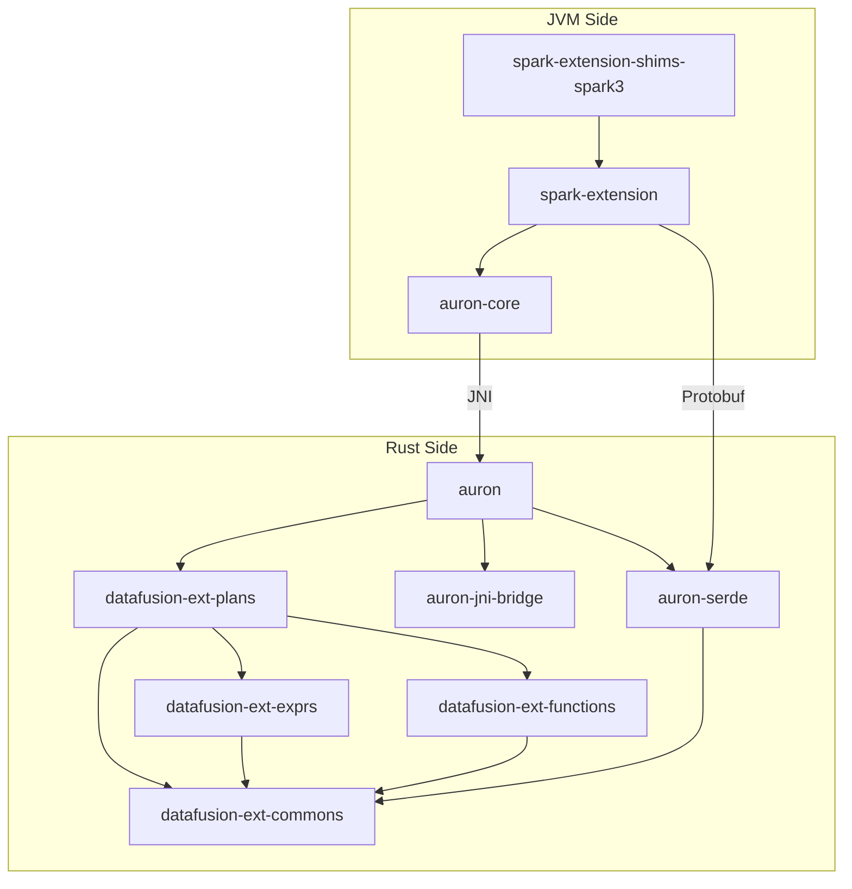

# Auron Module Deep Dives

This document provides detailed information about each module in the Auron codebase, including purpose, key files, abstractions, dependencies, and entry points.

## Module Dependency Graph



---

## 1. Spark Extension Layer (spark-extension)

### Purpose
The core Scala module that integrates Auron with Apache Spark. Contains base classes for all native operators, expression converters, and the main extension hook.

### Location
`spark-extension/src/main/scala/org/apache/spark/sql/`

### Key Files

| File | Purpose | Start Here? |
|------|---------|-------------|
| `auron/AuronSparkSessionExtension.scala` | Main entry point, Spark extension hook | ✅ Yes |
| `auron/AuronColumnarOverrides.scala` | ColumnarRule that triggers conversion | ✅ Yes |
| `auron/AuronConverters.scala` | Converts SparkPlan to native operators | ✅ Yes |
| `auron/AuronConvertStrategy.scala` | Analyzes plan convertibility | |
| `auron/NativeConverters.scala` | Converts expressions to Protobuf | |
| `auron/NativeRDD.scala` | RDD wrapper for native execution | |
| `auron/NativeHelper.scala` | Utility functions for native execution | |
| `auron/AuronCallNativeWrapper.scala` | Manages single native task execution | |
| `auron/Shims.scala` | Version abstraction interface | |
| `execution/auron/plan/*.scala` | Base classes for all native operators | |

### Core Abstractions

#### AuronSparkSessionExtension
```scala
// spark-extension/.../auron/AuronSparkSessionExtension.scala:30
class AuronSparkSessionExtension extends (SparkSessionExtensions => Unit) {
  override def apply(extensions: SparkSessionExtensions): Unit = {
    // Inject columnar override rule
    extensions.injectColumnar(_ => AuronColumnarOverrides)
  }
}
```

#### NativeSupports Trait
```scala
// spark-extension/.../auron/NativeSupports.scala
trait NativeSupports extends SparkPlan {
  // Override this to generate native plan
  protected def doExecuteNative(): NativeRDD

  // Standard execution routes through native
  override protected def doExecute(): RDD[InternalRow] = doExecuteNative()
}
```

#### AuronConverters Object
```scala
// spark-extension/.../auron/AuronConverters.scala:50
object AuronConverters {
  // Main entry point for plan conversion
  def convertSparkPlanRecursively(plan: SparkPlan): SparkPlan = {
    // Pattern match on SparkPlan types
    // Convert supported operators to NativeXxxExec
    // Recursively process children
  }
}
```

### Dependencies
- **Depends on**: Apache Spark core, auron-core
- **Depended by**: spark-extension-shims-spark3

### Entry Points
1. `AuronSparkSessionExtension.apply()` - Called by Spark to register extension
2. `AuronColumnarOverrides.preColumnarTransitions()` - Triggers plan conversion
3. `AuronConverters.convertSparkPlanRecursively()` - Recursive plan conversion

---

## 2. Spark Extension Shims (spark-extension-shims-spark3)

### Purpose
Contains Spark 3.x version-specific implementations of native operators. Handles API differences between Spark 3.0, 3.1, 3.2, 3.3, 3.4, and 3.5.

### Location
`spark-extension-shims-spark3/src/main/scala/org/apache/spark/sql/`

### Key Files

| File | Purpose | Start Here? |
|------|---------|-------------|
| `auron/ShimsImpl.scala` | Version-specific factory implementation | ✅ Yes |
| `execution/auron/plan/*.scala` | Concrete operator implementations | ✅ Yes |

### Core Abstractions

#### ShimsImpl
```scala
// spark-extension-shims-spark3/.../auron/ShimsImpl.scala
class ShimsImpl extends Shims {
  // Factory methods for all native operators
  override def createNativeFilterExec(condition: Expression, child: SparkPlan): SparkPlan =
    NativeFilterExec(condition, child)

  override def createNativeProjectExec(projectList: Seq[NamedExpression], child: SparkPlan): SparkPlan =
    NativeProjectExec(projectList, child)

  // ... factories for all operators
}
```

#### Concrete Operators
```scala
// spark-extension-shims-spark3/.../plan/NativeFilterExec.scala
case class NativeFilterExec(condition: Expression, override val child: SparkPlan)
    extends NativeFilterBase(condition, child) {

  // Spark 3.2+ requires withNewChildInternal
  override protected def withNewChildInternal(newChild: SparkPlan): SparkPlan =
    copy(child = newChild)
}
```

### Version Differences Handled
- `withNewChildInternal()` (Spark 3.2+) vs `withNewChildren()` (Spark 3.0/3.1)
- Column statistics API changes
- Adaptive query execution API evolution
- Expression evaluation changes

### Dependencies
- **Depends on**: spark-extension (base classes)
- **Depended by**: None (end of dependency chain)

### Entry Points
1. `Shims.get` loads `ShimsImpl` via reflection
2. `ShimsImpl.createXxx()` factory methods create operators

---

## 3. Protobuf Serialization (auron-serde)

### Purpose
Defines the Protocol Buffer schema for serializing execution plans and expressions. Provides Rust serialization/deserialization code.

### Location
`native-engine/auron-serde/`

### Key Files

| File | Purpose | Start Here? |
|------|---------|-------------|
| `proto/auron.proto` | Main Protobuf schema definition | ✅ Yes |
| `src/from_proto.rs` | Deserialize Protobuf to Rust types | ✅ Yes |
| `src/to_proto.rs` | Serialize Rust types to Protobuf | |
| `src/lib.rs` | Module exports | |
| `build.rs` | Code generation during build | |

### Core Abstractions

#### PhysicalPlanNode (Protobuf)
```protobuf
// native-engine/auron-serde/proto/auron.proto:50
message PhysicalPlanNode {
  oneof PhysicalPlanType {
    FilterExecNode filter = 8;
    ProjectionExecNode projection = 7;
    SortExecNode sort = 9;
    AggExecNode agg = 17;
    SortMergeJoinExecNode sort_merge_join = 13;
    HashJoinExecNode hash_join = 14;
    ParquetScanExecNode parquet_scan = 5;
    OrcScanExecNode orc_scan = 6;
    ShuffleWriterExecNode shuffle_writer = 2;
    // ... 20+ operator types
  }
}
```

#### PhysicalExprNode (Protobuf)
```protobuf
// native-engine/auron-serde/proto/auron.proto:150
message PhysicalExprNode {
  oneof ExprType {
    PhysicalColumn column = 1;
    ScalarValue literal = 2;
    PhysicalBinaryExprNode binary_expr = 4;
    PhysicalCastNode cast = 6;
    PhysicalCaseNode case_ = 8;
    PhysicalScalarFunctionNode scalar_function = 9;
    PhysicalAggExprNode agg_expr = 10;
    // ... 30+ expression types
  }
}
```

#### from_proto Module
```rust
// native-engine/auron-serde/src/from_proto.rs:100
pub fn convert_physical_plan(
    plan: &PhysicalPlanNode,
    ctx: &SessionContext,
) -> Result<Arc<dyn ExecutionPlan>> {
    match &plan.physical_plan_type {
        Some(PhysicalPlanType::Filter(filter)) => {
            let input = convert_physical_plan(filter.input.as_ref().unwrap(), ctx)?;
            let predicates = filter.expr.iter()
                .map(|e| convert_physical_expr(e, input.schema()))
                .collect::<Result<Vec<_>>>()?;
            Ok(Arc::new(FilterExec::new(predicates, input)))
        }
        // ... match arms for all operator types
    }
}
```

### Dependencies
- **Depends on**: datafusion-ext-commons, prost (protobuf library)
- **Depended by**: auron (main runtime)

### Entry Points
1. Protobuf schema defines serialization format
2. `from_proto::convert_physical_plan()` - Plan deserialization
3. `from_proto::convert_physical_expr()` - Expression deserialization

---

## 4. JNI Bridge Layer

This spans two locations: Java/Scala side and Rust side.

### Java Side (auron-core)

#### Purpose
Provides the Java interface for calling into native Rust code via JNI.

#### Location
`auron-core/src/main/java/org/apache/auron/`

#### Key Files

| File | Purpose | Start Here? |
|------|---------|-------------|
| `jni/JniBridge.java` | JNI native method declarations | ✅ Yes |
| `jni/AuronAdaptor.java` | Abstract adaptor for Auron engine | ✅ Yes |
| `conf/AuronConf.java` | Configuration handling | |
| `memory/OnHeapSpillManager.java` | JVM memory management | |

#### Core Abstractions

```java
// auron-core/.../jni/JniBridge.java:20
public class JniBridge {
    // Start native execution, returns runtime pointer
    public static native long callNative(
        long initNativeMemory,
        String logLevel,
        AuronCallNativeWrapper wrapper);

    // Get next Arrow batch
    public static native boolean nextBatch(long ptr);

    // Release native resources
    public static native void finalizeNative(long ptr);

    // Cleanup on JVM exit
    public static native void onExit();
}
```

### Rust Side (auron-jni-bridge)

#### Purpose
Rust utilities for JNI interop: thread-local JNI environment, local reference management, Java class caching.

#### Location
`native-engine/auron-jni-bridge/src/`

#### Key Files

| File | Purpose | Start Here? |
|------|---------|-------------|
| `jni_bridge.rs` | JNI utilities and thread-local env | ✅ Yes |
| `lib.rs` | Module exports | |

#### Core Abstractions

```rust
// native-engine/auron-jni-bridge/src/jni_bridge.rs:30
thread_local! {
    // Thread-local JNI environment
    pub static THREAD_JNIENV: RefCell<Option<*mut JNIEnv>> = RefCell::new(None);
}

// RAII wrapper for JNI local references
pub struct LocalRef<'a> {
    obj: JObject<'a>,
    env: &'a JNIEnv<'a>,
}

// Cached Java class references
pub struct JavaClasses {
    pub auron_call_native_wrapper: GlobalRef,
    pub runtime_exception: GlobalRef,
    // ... other cached classes
}
```

### JNI Call Flow
```
JVM                                 Rust
 │                                   │
 │  JniBridge.callNative()          │
 │ ─────────────────────────────────▶│
 │                                   │ Java_org_apache_spark_sql_auron_
 │                                   │   JniBridge_callNative()
 │                                   │ ─────▶ init_jni_bridge()
 │                                   │ ─────▶ create NativeExecutionRuntime
 │  returns: long (runtime ptr)      │
 │ ◀─────────────────────────────────│
 │                                   │
 │  JniBridge.nextBatch(ptr)        │
 │ ─────────────────────────────────▶│
 │                                   │ execute_plan()
 │                                   │ produce Arrow batch
 │                                   │ call wrapper.importBatch()
 │  returns: boolean (has more)      │
 │ ◀─────────────────────────────────│
 │                                   │
 │  JniBridge.finalizeNative(ptr)   │
 │ ─────────────────────────────────▶│
 │                                   │ drop NativeExecutionRuntime
 │ ◀─────────────────────────────────│
```

### Dependencies
- **Java depends on**: JNI libraries
- **Rust depends on**: jni crate
- **Depended by**: auron (main runtime)

---

## 5. Rust Execution Engine (auron)

### Purpose
Main Rust crate that coordinates native execution. Contains JNI entry points, runtime management, and DataFusion session configuration.

### Location
`native-engine/auron/src/`

### Key Files

| File | Purpose | Start Here? |
|------|---------|-------------|
| `lib.rs` | JNI entry points, runtime init | ✅ Yes |
| `rt.rs` | NativeExecutionRuntime definition | ✅ Yes |
| `exec.rs` | Plan execution logic | |
| `logging.rs` | Logging configuration | |

### Core Abstractions

#### JNI Entry Point
```rust
// native-engine/auron/src/lib.rs:50
#[no_mangle]
pub extern "system" fn Java_org_apache_spark_sql_auron_JniBridge_callNative(
    env: JNIEnv,
    _class: JClass,
    executor_memory_overhead: i64,
    log_level: JString,
    native_wrapper: JObject,
) -> i64 {
    // 1. Initialize JNI bridge
    // 2. Create DataFusion SessionContext
    // 3. Create NativeExecutionRuntime
    // 4. Return pointer as i64
}
```

#### NativeExecutionRuntime
```rust
// native-engine/auron/src/rt.rs:30
pub struct NativeExecutionRuntime {
    // DataFusion session with configuration
    pub session_ctx: SessionContext,

    // The execution plan to run
    pub plan: Arc<dyn ExecutionPlan>,

    // Current partition being processed
    pub partition: usize,

    // Batch stream from execution
    pub stream: Option<SendableRecordBatchStream>,

    // JNI callback wrapper
    pub native_wrapper: GlobalRef,
}
```

### Dependencies
- **Depends on**: auron-serde, auron-jni-bridge, datafusion-ext-plans, DataFusion
- **Depended by**: None (top of Rust dependency chain)

### Entry Points
1. `Java_org_apache_spark_sql_auron_JniBridge_callNative` - Start execution
2. `Java_org_apache_spark_sql_auron_JniBridge_nextBatch` - Get next batch
3. `Java_org_apache_spark_sql_auron_JniBridge_finalizeNative` - Cleanup

---

## 6. DataFusion Extensions (datafusion-ext-*)

### Purpose
Custom DataFusion physical plan operators and expressions that extend DataFusion's capabilities for Spark compatibility.

### Location
`native-engine/datafusion-ext-plans/src/` and related crates

### Key Files

| Crate | Key Files | Purpose |
|-------|-----------|---------|
| **datafusion-ext-plans** | | |
| | `lib.rs` | Module exports |
| | `agg/agg_exec.rs` | Hash/Sort aggregation |
| | `filter_exec.rs` | Filter execution |
| | `project_exec.rs` | Projection execution |
| | `sort_exec.rs` | Sort execution |
| | `sort_merge_join_exec.rs` | Sort-merge join |
| | `broadcast_join_exec.rs` | Broadcast join |
| | `shuffle_writer_exec.rs` | Shuffle write |
| | `parquet_exec.rs` | Parquet scan |
| | `window/` | Window functions |
| | `memmgr/` | Memory management |
| **datafusion-ext-exprs** | | |
| | `lib.rs` | Expression exports |
| | `cast.rs` | Cast expressions |
| | `string_funcs.rs` | String functions |
| | `datetime_funcs.rs` | Date/time functions |
| **datafusion-ext-functions** | | |
| | `lib.rs` | SQL function registry |
| **datafusion-ext-commons** | | |
| | `lib.rs` | Shared utilities |

### Core Abstractions

#### Custom ExecutionPlan
```rust
// native-engine/datafusion-ext-plans/src/filter_exec.rs:20
#[derive(Debug)]
pub struct FilterExec {
    /// Filter predicates
    predicates: Vec<Arc<dyn PhysicalExpr>>,
    /// Input execution plan
    input: Arc<dyn ExecutionPlan>,
    /// Output schema (same as input for filter)
    schema: SchemaRef,
    /// Metrics
    metrics: ExecutionPlanMetricsSet,
}

impl ExecutionPlan for FilterExec {
    fn execute(
        &self,
        partition: usize,
        context: Arc<TaskContext>,
    ) -> Result<SendableRecordBatchStream> {
        // Execute input plan
        // Apply filter predicates to each batch
        // Return filtered stream
    }
}
```

#### Aggregation System
```rust
// native-engine/datafusion-ext-plans/src/agg/agg_exec.rs:50
pub enum AggExecMode {
    HashAgg,  // Hash-based aggregation
    SortAgg,  // Sort-based aggregation
}

pub struct AggExec {
    mode: AggExecMode,
    group_by: Vec<Arc<dyn PhysicalExpr>>,
    aggr_exprs: Vec<Arc<dyn AggregateExpr>>,
    input: Arc<dyn ExecutionPlan>,
    // ...
}
```

### Dependencies
- **datafusion-ext-plans depends on**: DataFusion, datafusion-ext-exprs, datafusion-ext-functions, datafusion-ext-commons
- **datafusion-ext-exprs depends on**: DataFusion, datafusion-ext-commons
- **datafusion-ext-functions depends on**: DataFusion, datafusion-ext-commons
- **datafusion-ext-commons depends on**: Arrow, DataFusion (minimal)

### Entry Points
1. Operators registered via `from_proto.rs` deserialization
2. Direct instantiation in Rust code for testing

---

## Module Summary

| Module | Language | Lines of Code* | Primary Responsibility |
|--------|----------|----------------|------------------------|
| spark-extension | Scala | ~15,000 | Spark integration, base operators |
| spark-extension-shims-spark3 | Scala | ~5,000 | Spark 3.x compatibility |
| auron-core | Java | ~3,000 | JNI bridge, configuration |
| auron | Rust | ~2,000 | Runtime coordination |
| auron-serde | Rust | ~4,000 | Protobuf serialization |
| auron-jni-bridge | Rust | ~1,000 | JNI utilities |
| datafusion-ext-plans | Rust | ~20,000 | Physical operators |
| datafusion-ext-exprs | Rust | ~5,000 | Expression evaluation |
| datafusion-ext-functions | Rust | ~2,000 | SQL functions |
| datafusion-ext-commons | Rust | ~3,000 | Shared utilities |

*Approximate, for relative comparison

---

## Next Steps

- **Trace execution paths**: See [CRITICAL-PATHS.md](CRITICAL-PATHS.md)
- **Add new operators**: See [EXTENSION-GUIDE.md](EXTENSION-GUIDE.md)
- **Key terms**: See [GLOSSARY.md](GLOSSARY.md)
