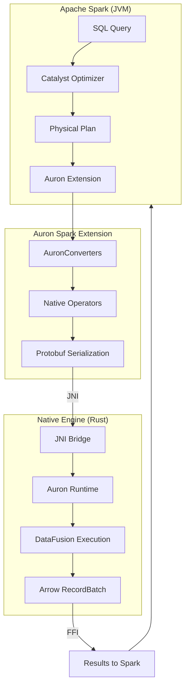

# Auron System Overview

## What is Auron?

Apache Auron is a **native vectorized execution accelerator** for Apache Spark. It replaces Spark's row-based execution with columnar, vectorized processing powered by Apache DataFusion (a Rust-based query engine) and Apache Arrow (a columnar memory format).

### Why Auron Exists

Spark's default execution model processes data row-by-row in the JVM. This approach has limitations:

| Challenge | Spark's Approach | Auron's Solution |
|-----------|------------------|------------------|
| Memory overhead | JVM objects with headers | Arrow columnar format (no overhead) |
| CPU efficiency | Row-at-a-time processing | Vectorized batch processing |
| JVM limitations | GC pauses, memory management | Native Rust with manual memory control |
| SIMD utilization | Limited JIT optimization | Explicit SIMD via DataFusion |

### Key Benefits

1. **Performance**: 2-10x faster query execution for supported operators
2. **Memory efficiency**: Reduced GC pressure and memory footprint
3. **Transparency**: Works with existing Spark SQL queries without code changes
4. **Compatibility**: Falls back to Spark execution for unsupported operations

## High-Level Architecture



### Components

| Component | Language | Purpose |
|-----------|----------|---------|
| **spark-extension** | Scala | Base classes for native operators, converters |
| **spark-extension-shims-spark3** | Scala | Spark 3.x version-specific implementations |
| **auron-core** | Java | JNI bridge, memory management, configuration |
| **native-engine/auron** | Rust | Main entry point, runtime coordination |
| **native-engine/auron-serde** | Rust | Protobuf serialization/deserialization |
| **native-engine/datafusion-ext-plans** | Rust | Custom DataFusion physical plan operators |
| **native-engine/datafusion-ext-exprs** | Rust | Custom expression implementations |
| **native-engine/auron-jni-bridge** | Rust | JNI utilities and macros |

## Data Flow

### Query Execution Flow

```
┌─────────────────────────────────────────────────────────────────────────┐
│ 1. SPARK QUERY PLANNING                                                  │
│    User submits SQL: SELECT * FROM t WHERE x > 10                       │
│    ↓                                                                     │
│    Catalyst creates optimized Physical Plan                              │
│    ↓                                                                     │
│    AuronSparkSessionExtension intercepts via ColumnarRule               │
└─────────────────────────────────────────────────────────────────────────┘
                                    ↓
┌─────────────────────────────────────────────────────────────────────────┐
│ 2. PLAN CONVERSION (Scala)                                               │
│    AuronConverters.convertSparkPlanRecursively()                        │
│    ↓                                                                     │
│    Each SparkPlan node → NativeXxxExec (e.g., FilterExec → NativeFilter)│
│    ↓                                                                     │
│    Expressions converted via NativeConverters.convertExpr()             │
└─────────────────────────────────────────────────────────────────────────┘
                                    ↓
┌─────────────────────────────────────────────────────────────────────────┐
│ 3. NATIVE PLAN SERIALIZATION                                             │
│    NativeXxxBase.doExecuteNative() creates NativeRDD                    │
│    ↓                                                                     │
│    Plan serialized to Protobuf (PhysicalPlanNode)                       │
│    ↓                                                                     │
│    NativeRDD.compute() called per partition                             │
└─────────────────────────────────────────────────────────────────────────┘
                                    ↓
┌─────────────────────────────────────────────────────────────────────────┐
│ 4. JNI BOUNDARY CROSSING                                                 │
│    AuronCallNativeWrapper created for each partition                    │
│    ↓                                                                     │
│    JniBridge.callNative() → Rust entry point                            │
│    ↓                                                                     │
│    TaskDefinition (protobuf) passed to Rust                             │
└─────────────────────────────────────────────────────────────────────────┘
                                    ↓
┌─────────────────────────────────────────────────────────────────────────┐
│ 5. RUST NATIVE EXECUTION                                                 │
│    NativeExecutionRuntime deserializes plan                             │
│    ↓                                                                     │
│    from_proto.rs converts Protobuf → DataFusion ExecutionPlan           │
│    ↓                                                                     │
│    DataFusion executes plan, produces Arrow RecordBatches               │
└─────────────────────────────────────────────────────────────────────────┘
                                    ↓
┌─────────────────────────────────────────────────────────────────────────┐
│ 6. RESULT RETURN (Arrow FFI)                                             │
│    JniBridge.nextBatch() returns Arrow data via FFI pointers            │
│    ↓                                                                     │
│    AuronCallNativeWrapper.importBatch() deserializes Arrow              │
│    ↓                                                                     │
│    AuronColumnarBatchRow converts to Spark InternalRow                  │
│    ↓                                                                     │
│    Iterator[InternalRow] returned to Spark                              │
└─────────────────────────────────────────────────────────────────────────┘
```

### Memory Flow

```
┌─────────────────┐         ┌─────────────────┐
│   JVM Heap      │         │  Native Memory  │
│                 │         │                 │
│  Spark Objects  │         │  Arrow Buffers  │
│  Task Context   │◄───────▶│  Rust Structs   │
│  Metrics        │   FFI   │  DataFusion     │
│                 │         │                 │
└─────────────────┘         └─────────────────┘
         │                           │
         ▼                           ▼
   OnHeapSpillManager         MemManager (spill to disk)
```

## Supported Operations

### Operators

| Operator | Support | Notes |
|----------|---------|-------|
| Filter | ✅ Full | All predicate types |
| Project | ✅ Full | Column selection, expressions |
| Sort | ✅ Full | Multi-column, nulls ordering |
| Aggregate | ✅ Full | Hash and Sort aggregation |
| Join | ✅ Full | Sort-merge, broadcast, hash |
| Scan (Parquet) | ✅ Full | Predicate pushdown, column pruning |
| Scan (ORC) | ✅ Full | Similar to Parquet |
| Exchange (Shuffle) | ✅ Full | Native shuffle writer |
| Window | ✅ Full | Row number, rank, dense_rank |
| Union | ✅ Full | Union all |
| Limit | ✅ Full | Global and local limits |
| Expand | ✅ Full | For ROLLUP/CUBE |
| Generate | ✅ Full | explode, posexplode |

### Expressions

| Category | Examples | Support |
|----------|----------|---------|
| Arithmetic | +, -, *, /, % | ✅ |
| Comparison | =, <>, <, >, <=, >= | ✅ |
| Logical | AND, OR, NOT | ✅ |
| String | substring, concat, like, trim | ✅ |
| Date/Time | date_add, date_sub, to_date | ✅ |
| Aggregate | count, sum, avg, min, max | ✅ |
| Cast | CAST expressions | ✅ |
| Case | CASE WHEN | ✅ |
| Null | IS NULL, COALESCE | ✅ |

### Data Types

| Type | Support | Notes |
|------|---------|-------|
| Boolean | ✅ | |
| Byte, Short, Int, Long | ✅ | |
| Float, Double | ✅ | |
| Decimal | ✅ | 64-bit precision |
| String | ✅ | |
| Date, Timestamp | ✅ | |
| Array | ✅ | |
| Map | ✅ | |
| Struct | ✅ | |

## Configuration

### Enabling Auron

```scala
spark.conf.set("spark.auron.enable", "true")  // Default: true
```

### Key Configuration Options

| Option | Default | Description |
|--------|---------|-------------|
| `spark.auron.enable` | true | Enable/disable Auron |
| `spark.auron.memory.fraction` | 0.6 | Fraction of executor memory for native |
| `spark.auron.enable.scan` | true | Enable native scans |
| `spark.auron.enable.project` | true | Enable native projections |
| `spark.auron.enable.filter` | true | Enable native filters |
| `spark.auron.enable.sort` | true | Enable native sorts |
| `spark.auron.enable.aggregate` | true | Enable native aggregations |
| `spark.auron.enable.join` | true | Enable native joins |

## Fallback Behavior

When an operation cannot be executed natively, Auron automatically falls back to Spark execution:

```
Native Plan                 Fallback Point           Spark Execution
     │                           │                         │
     ▼                           ▼                         ▼
┌─────────┐              ┌──────────────┐           ┌─────────┐
│ Native  │              │ ConvertTo-   │           │ Spark   │
│ Filter  │─────────────▶│ Native/      │──────────▶│ Join    │
│         │              │ ConvertFrom- │           │ (row)   │
└─────────┘              │ Native       │           └─────────┘
                         └──────────────┘
```

Common fallback reasons:
- Unsupported expression types
- Complex UDFs without native implementation
- Data types without Arrow mapping
- Operations requiring non-deterministic behavior

## Next Steps

- **Module Deep Dives**: See [MODULE-GUIDE.md](MODULE-GUIDE.md) for detailed component documentation
- **Execution Paths**: See [CRITICAL-PATHS.md](CRITICAL-PATHS.md) for code-level tracing
- **Contributing**: See [EXTENSION-GUIDE.md](EXTENSION-GUIDE.md) and [CONTRIBUTING.md](../../CONTRIBUTING.md)
